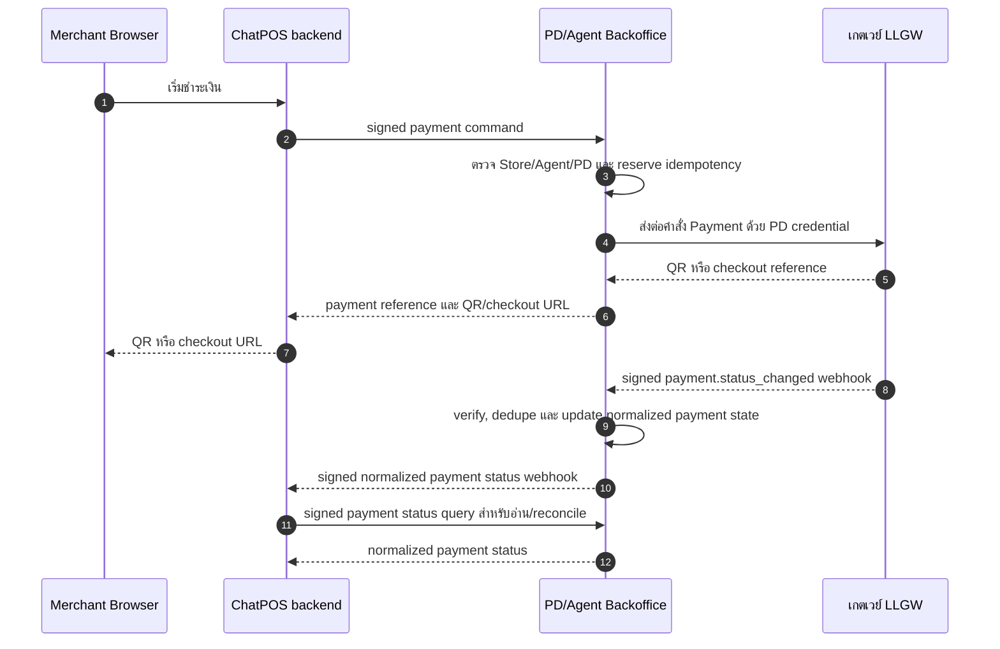
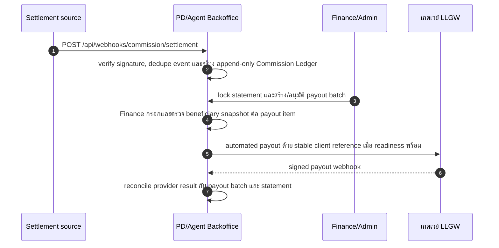
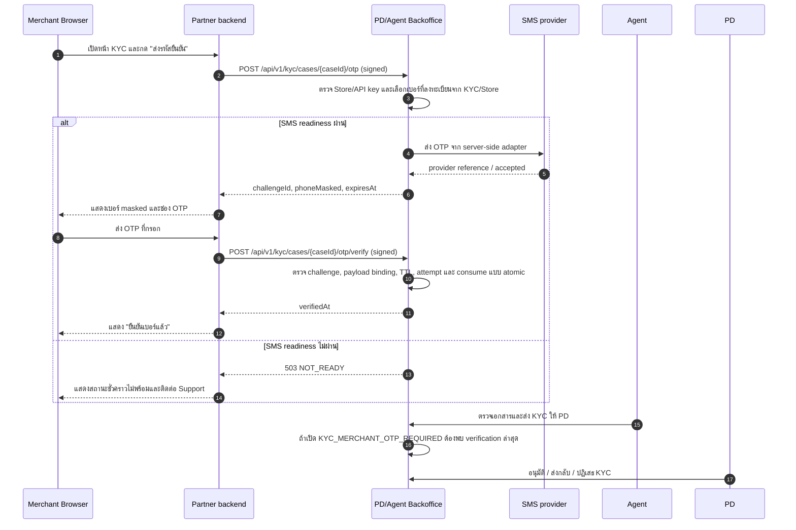

# คู่มือเชื่อมต่อสำหรับ chatpos.biz และ Integration Partner

Contract version: 2026-08-20

เอกสารนี้เป็น current integration contract ที่ Merchant Browser และ backend ของ `chatpos.biz` หรือ Integration Partner รายอื่นใช้เชื่อมกับ PD/Agent Backoffice สำหรับ Merchant-Agent Assignment, KYC document intake, merchant phone OTP, payment routing, Assignment status callback และ Commission settlement event โดยคำว่า `chatpos.biz` ในตัวอย่างหมายถึง partner backend ที่ได้รับ credential ของ Store นั้น

ระบบแบ่งเส้นทางเงินออกเป็นสองส่วน:

- **Pay-in:** Merchant Browser เรียก `chatpos.biz`, จากนั้น `chatpos.biz` ส่ง signed payment command ไป PD/Agent และ PD/Agent เป็นผู้ใช้ LLGW credential. `chatpos.biz` ห้ามมี LLGW credential และห้ามเรียก LLGW Client API โดยตรง
- **Pay-out:** PD/Agent เป็นผู้รับผิดชอบ Commission payout และเป็นผู้ส่ง payout ไป LLGW จาก Backoffice เท่านั้น. `chatpos.biz` ส่งได้เฉพาะ signed immutable settlement fact ตาม contract ที่ได้รับอนุมัติ และห้าม submit payout หรือเรียก LLGW โดยตรง. Payout submit ยังอยู่หลัง `LLGW_PAYOUT_ENABLED` และ production readiness gate; การเปิด flag ไม่เปลี่ยน ownership หรือเปิดให้ partner เรียก LLGW

ผลจาก LLGW ของ pay-in ต้องวิ่งกลับผ่าน `LLGW -> PD/Agent webhook -> PD/Agent verify/dedupe/update payment state`; หลังจากนั้น PD/Agent แจ้ง normalized payment status กลับไปยัง Merchant ผ่าน webhook ที่ลงทะเบียนไว้. ผล payout ในอนาคตจะวิ่งกลับผ่าน `LLGW -> PD/Agent payout webhook` เพื่อ reconcile กับ payout batch และไม่ใช่ payment status callback เดียวกัน

## 1. ภาพรวมการเชื่อมต่อ

### 1.1 Pay-in: รับเงินจาก Merchant



เส้นทาง pay-in คือ `Merchant Browser -> chatpos.biz -> PD/Agent -> LLGW`, `LLGW -> PD/Agent payment webhook` และ `PD/Agent -> chatpos.biz payment-status webhook`. `chatpos.biz` ใช้ signed status query เพื่ออ่านหรือ reconcile normalized payment status และห้ามเรียก LLGW polling โดยตรง

### 1.2 Pay-out: จ่าย Commission ให้ PD/Agent



Pay-out ใช้ settlement fact เป็นต้นทาง ไม่ใช้ payment callback เป็นหลักฐานการจ่าย Commission. Finance ใช้ payout submit UI/action ภายใน Backoffice และกรอกข้อมูล beneficiary ที่ตรวจสอบแล้ว; ระบบเก็บ account name/number เป็น encrypted snapshot ต่อ item และไม่ดึงข้อมูลจาก `chatpos.biz` หรือใช้คำขอถอนล่าสุดโดยอัตโนมัติ. การ submit ต้องผ่าน role และ LLGW readiness guard, ใช้ stable `clientReference`/`Idempotency-Key` และรับ `LLGW -> PD/Agent payout webhook` เพื่อเปลี่ยนสถานะจากผล provider ที่ verify แล้วหรือ audited reconciliation. รายการที่อยู่ระหว่าง `processing`, `under_review` หรือผล submit ยังไม่แน่ชัดจะไม่ถูก retry อัตโนมัติ. Withdrawal OTP มี SMSUP adapter แล้วแต่ยังไม่ใช่ production-ready จนกว่า delivery/abuse controls และ staging evidence จะผ่าน. Partner ไม่ควรสร้าง payout operation, ขอ OTP หรือเรียก payout endpoint ของ LLGW เอง

### 1.3 Flow สมัคร Merchant เพื่อขออยู่ภายใต้ Agent

```mermaid
flowchart TD
  M[Merchant สมัครร้านค้าใน chatpos.biz] --> P[chatpos.biz สร้าง Merchant/Store และยืนยันตัวตน]
  P --> A[Merchant กรอกเบอร์โทร Agent หรือเว้นว่างได้]
  A --> R[chatpos.biz ส่ง signed Assignment request ไป Backoffice]
  R --> C{มีเบอร์ Agent หรือไม่}
  C -->|ไม่มีเบอร์| Q[สถานะ PENDING_ADMIN_ASSIGNMENT]
  Q --> H[Admin/Operations จัดสรร Agent และ PD]
  H --> W[สถานะ PENDING_AGENT_ACCEPTANCE]
  C -->|มีเบอร์| C2{ตรวจสอบ Agent และ PD ต้นสังกัด}
  C2 -->|ไม่พบหรือไม่พร้อมใช้งาน| X[แจ้ง Merchant แก้เบอร์หรือขอจัดสรร Agent ใหม่]
  C2 -->|พร้อมใช้งาน| W
  W --> D{Agent ตัดสินใจ}
  D -->|ปฏิเสธหรือหมด SLA| X
  D -->|กดรับดูแล| L[Backoffice ผูก Merchant กับ Agent และ PD]
  L --> N[ส่ง signed Assignment callback กลับ chatpos.biz]
  N --> U{มีข้อมูล Merchant หรือเอกสารเปลี่ยนแปลงหรือไม่}
  U -->|ไม่มี| K[chatpos.biz ส่ง immutable KYC document versions]
  U -->|ข้อมูล Merchant/Store| P2[PATCH /api/v1/stores/profile]
  U -->|เอกสาร KYC| K2[POST /api/v1/kyc/cases/{caseId}/documents ด้วย version ใหม่]
  P2 --> K
  K2 --> K
  K --> O[chatpos.biz ขอ KYC OTP ผ่าน Backoffice]
  O --> S1[แสดงหน้ากรอก OTP ให้เจ้าของร้าน]
  S1 --> O2[chatpos.biz ส่ง OTP กลับให้ Backoffice verify]
  O2 --> V[Agent ตรวจเอกสารและส่ง Submission Package]
  V --> Q{PD ตรวจ KYC ขั้นสุดท้าย}
  Q -->|ส่งกลับ| V
  Q -->|ปฏิเสธ| J[แจ้งผล KYC ไม่ผ่าน]
  Q -->|อนุมัติ| S[Merchant พร้อมเข้าสู่ขั้นตอนเปิดใช้งาน Payment]
```

กติกาสำคัญของ flow นี้คือ Merchant ยังไม่อยู่ภายใต้ Agent หรือ PD จนกว่า Agent จะกดรับคำขอสำเร็จ ถ้าไม่กรอกเบอร์ Agent คำขอจะอยู่ใน `PENDING_ADMIN_ASSIGNMENT` จนกว่า Admin/Operations จะจัดสรร Agent ที่มี PD ต้นสังกัด แล้วจึงเข้าสู่ `PENDING_AGENT_ACCEPTANCE`; PD เป็นผู้อนุมัติ KYC ขั้นสุดท้าย

การแก้ไขข้อมูลจาก Merchant/POS ทุกครั้งต้องส่งกลับเข้า Backoffice ผ่าน API ที่ signed และมี idempotency ห้ามแก้ข้อมูลในฐานข้อมูลโดยตรง การแก้ข้อมูลที่กระทบ KYC ต้องเข้าสู่ Agent review และ PD final approval ใหม่ตาม policy; เอกสาร KYC ต้องเพิ่ม version ใหม่และห้าม overwrite version เดิม

### 1.4 KYC phone OTP ผ่าน PD/Agent

OTP ใน flow นี้เป็น **Merchant phone ownership proof** ไม่ใช่ผลอนุมัติ KYC และไม่ใช่ OTP ของธนาคารหรือ LLGW ผู้เชื่อมต่อรายอื่นต้องใช้ flow เดียวกับ `chatpos.biz` ดังนี้

สถานะ readiness ปัจจุบัน: contract, endpoint และ SMSUP adapter มีอยู่แล้ว แต่ระบบยังต้องผ่าน `SMS_OTP_ENABLED=true`, configuration ครบ, delivery/abuse controls และ staging evidence ก่อนเปิดใช้งานจริง. หาก readiness ไม่ผ่าน Backoffice จะตอบ `503 NOT_READY` และห้ามแสดงว่า SMS ถูกส่งสำเร็จ. `KYC_MERCHANT_OTP_REQUIRED` ต้องคงเป็น `false` จนกว่า flow นี้จะผ่าน staging และ release gate ครบ:



กติกาความเป็นเจ้าของ:

- Browser คุยกับ backend ของ partner เท่านั้น; ห้ามเรียก Backoffice จาก browser โดยตรง
- Partner backend เป็นผู้ถือ bearer/signing secret และเป็นผู้ sign request; Browser ห้ามถือ secret
- Backoffice เลือกเบอร์จากข้อมูลที่ลงทะเบียน, ขอ OTP จาก SMSUP, ส่ง `otpId` ให้ provider ตอน verify และบันทึก audit; SMSUP เป็นผู้สร้างและตรวจ OTP
- Partner ห้ามส่ง `phone`, `otpHash`, SMS credential, LLGW credential หรือ `storeId` ที่เลือกเองใน request
- Backoffice คืนเฉพาะ `phoneMasked`, `challengeId`, `expiresAt` และผล `verifiedAt`; ห้ามคืนเบอร์เต็มหรือ OTP
- การ verify สำเร็จไม่ทำให้ KYC approved และไม่ข้าม Agent review หรือ PD final approval

เบอร์ปลายทางใช้ลำดับ `KycVerification.phone` -> เบอร์เจ้าของ Store ที่ลงทะเบียน -> `Store.phone` ถ้าไม่มีเบอร์ที่ถูกต้อง API จะตอบ `PHONE_REQUIRED` โดย partner ต้องพาผู้สมัครกลับไปแก้ข้อมูลผ่านช่องทางที่ได้รับอนุญาต แล้วเริ่ม challenge ใหม่

การส่ง Transaction ผ่าน Backoffice ต้องมี command endpoint และ contract เพิ่มเติมจาก API ปัจจุบัน ซึ่งยังไม่ควรใช้ `GET /api/v1/transactions/{id}/payment` แทน เพราะ endpoint ดังกล่าวเป็น read-only และ `POST /api/v1/transactions/{id}/promptpay` ถูก retire แล้ว

## 2. สิ่งที่ต้องขอจากทีม Backoffice

Credential ออกแยกต่อ Store และใช้ข้าม Store ไม่ได้ ทีม `chatpos.biz` ต้องส่งข้อมูลต่อไปนี้ให้ทีม Backoffice:

| รายการ | ตัวอย่าง placeholder |
| --- | --- |
| Environment | `test` หรือ `production` |
| Store ID / Merchant ID | ID ที่ตกลงร่วมกัน |
| Credential owner | ชื่อทีม/ระบบ ไม่ใช้ชื่อบุคคลเป็น secret label |
| Merchant webhook URL | `https://merchant.example.test/api/webhooks/chatpos` (ลงทะเบียนใน Assignment request) |
| Outbound IP/CIDR | เตรียมไว้สำหรับ IP allowlist เมื่อ enforcement พร้อม |

ทีม Backoffice จะส่งมอบ:

| ค่า | การใช้งาน | การจัดเก็บ |
| --- | --- | --- |
| Base URL | URL ของ Agent/PD Backoffice | application config |
| Bearer secret | ระบุ API key | secret manager เท่านั้น |
| Signing secret | HMAC request signature | secret manager เท่านั้น |
| Key ID/prefix | support และ rotation โดยไม่เปิด secret | config/log ได้ |
| Merchant webhook secret | verify Assignment, ownership, KYC, Store และ payment events | secret manager เท่านั้น; คืนจาก Assignment registration ครั้งแรก |
| Commission webhook secret | sign settlement event; ส่งเมื่อ integration นี้ได้รับอนุมัติ | secret manager เท่านั้น |

ห้ามส่ง bearer/signing/webhook secret ผ่าน ticket, email, source code, URL, browser storage หรือ application log

## 3. Base URL และ Endpoints

ให้ทีม Backoffice ยืนยัน Base URL ของแต่ละ environment ก่อนเริ่มทดสอบ ตัวอย่างในเอกสารใช้:

```text
https://member-test.example.com
```

| Method | Endpoint | Scope / Authentication | หน้าที่ |
| --- | --- | --- | --- |
| `POST` | `/api/v1/assignments/requests` | `assignment:create` + signed Merchant API | ขอผูก Store กับ Agent; `agentPhone` ไม่บังคับ ถ้าไม่ส่งจะเข้าคิว Admin |
| `PATCH` | `/api/v1/stores/profile` | `store:profile:update` + signed Merchant API | ส่งข้อมูล Merchant/Store ที่แก้ไข โดย Store มาจาก API key |
| `POST` | `/api/v1/kyc/cases/{caseId}/documents` | `kyc:document:create` + signed Merchant API | ลงทะเบียน immutable KYC document version |
| `POST` | `/api/v1/kyc/cases/{caseId}/otp` | `kyc:otp:request` + signed Merchant API | สร้าง challenge และขอส่ง SMS ไปยังเบอร์ Merchant ที่ลงทะเบียน; ถ้า provider ยังไม่พร้อมตอบ `503 NOT_READY` |
| `POST` | `/api/v1/kyc/cases/{caseId}/otp/verify` | `kyc:otp:verify` + signed Merchant API | verify OTP และบันทึก phone ownership proof |
| `POST` | `/api/v1/transactions/{id}/payment` | `payment:create` + signed Merchant API | ให้ ChatPOS สั่ง PD/Agent สร้าง PromptPay QR หรือ Hosted Checkout แล้ว PD/Agent ส่งต่อไป LLGW |
| `GET` | `/api/v1/transactions/{id}/payment` | `payment:read` + signed Merchant API | ให้ ChatPOS อ่านหรือ reconcile normalized payment status และ gateway reference จาก PD/Agent |
| `POST` | `/api/webhooks/llgw/payment` | LLGW signature; internal receiver | LLGW ส่ง `payment.status_changed` เข้า Backoffice เท่านั้น; `chatpos.biz` ไม่เรียก endpoint นี้ |
| `POST` | `/api/webhooks/commission/settlement` | `X-Commission-Signature` | ส่ง immutable final settlement fact หลังเปิด feature |

ห้ามเรียก `POST /api/v1/transactions/{id}/promptpay`; endpoint นี้ retired และตอบ `410 PAYMENT_COMMAND_MOVED` พร้อม replacement เป็น `/api/v1/transactions/{id}/payment`

### 3.1 สร้าง PromptPay QR หรือ Hosted Checkout

`chatpos.biz` ต้องมี Transaction อยู่ใน Backoffice ก่อน แล้วเรียก command นี้ด้วย API key ของ Store เดียวกัน:

```http
POST /api/v1/transactions/{id}/payment
```

Request body ขั้นต่ำ:

```json
{
  "paymentMethod": "promptpay"
}
```

สำหรับ Hosted Checkout ให้ใช้ `paymentMethod` ตาม channel ที่ LLGW เปิดให้ Store/PD เช่น `checkout`, `card`, `mobile_banking` หรือ `alipay_online`. ส่ง `redirectUrl` และ `failedRedirectUrl` ได้เมื่อ client ต้องการกำหนดปลายทางหลัง checkout:

```json
{
  "paymentMethod": "checkout",
  "redirectUrl": "https://merchant.example/payment/success",
  "failedRedirectUrl": "https://merchant.example/payment/failed",
  "description": "Order payment"
}
```

PD/Agent derive จำนวนเงิน, order reference, Merchant, Agent และ PD จาก Transaction/Store ที่ authenticated API key เป็นเจ้าของ ไม่รับ `storeId`, amount หรือ gateway credential จาก request body. ระบบสร้าง stable `clientReference` จาก `Transaction.reference`, ส่งคำสั่งต่อ LLGW ด้วย PD credential และคืนผลที่เหมาะกับช่องทาง:

- PromptPay: `qrString` หรือ `qrImageUrl`
- Hosted Checkout: `checkoutRedirectUrl`
- ทุกช่องทาง: `clientReference`, `gatewayReference`, `status`, `expiresAt`

ห้าม retry ด้วย `Idempotency-Key` ใหม่เมื่อไม่ทราบผลจาก timeout. ให้สร้าง nonce/timestamp/signature ใหม่ แต่คง key และ raw body เดิม. Payment status ที่ยืนยันแล้วให้อ่านจาก `GET /api/v1/transactions/{id}/payment` หรือรับจาก signed payment-status webhook ของ PD/Agent; ห้ามเรียก LLGW polling endpoint จาก `chatpos.biz`

## 4. Signed Merchant API

### 4.1 Required headers

```http
Authorization: Bearer <bearer-secret>
Content-Type: application/json
X-ChatPOS-Timestamp: <unix-seconds>
X-ChatPOS-Nonce: <unique-16-to-128-characters>
X-ChatPOS-Signature: v1=<lowercase-hmac-sha256-hex>
Idempotency-Key: <stable-business-operation-key>
X-Request-Id: <correlation-id>
```

`Idempotency-Key` บังคับสำหรับทุก command ได้แก่ Assignment, Merchant profile update, KYC document intake, KYC OTP request/verify และ payment creation ห้ามสร้าง key ใหม่เพียงเพราะ request timeout; ให้ retry operation เดิมด้วย key และ raw body เดิม ส่วน `sourceRequestId` เป็น business request identity ใน body ของ command ที่ contract ระบุ และ `X-Request-Id` ใช้เป็น correlation ID ของ HTTP request

### 4.2 Canonical request

นำค่าต่อไปนี้มาต่อด้วย LF (`\n`) โดยไม่มี trailing LF:

```text
UPPERCASE_METHOD
PATH_WITH_SORTED_QUERY
TIMESTAMP
NONCE
IDEMPOTENCY_KEY_OR_EMPTY
SHA256_HEX_OF_EXACT_RAW_BODY
```

ข้อกำหนด:

1. Path ต้องมี leading `/` และไม่รวม scheme/host
2. Query เรียงตาม key แล้วตาม value
3. Timestamp เป็น Unix seconds และคลาดจาก server ไม่เกิน 5 นาที
4. Nonce ใช้ได้ครั้งเดียวต่อ API key และต้องยาว 16-128 ตัวอักษรกลุ่ม `A-Z a-z 0-9 _ -`
5. JSON ต้อง serialize ครั้งเดียว แล้วใช้ string เดียวกันทั้ง hash, signature และ HTTP body
6. Signature คือ `v1=` ตามด้วย lowercase hex ของ `HMAC-SHA256(signingSecret, canonicalRequest)`

### 4.3 TypeScript signing example

ตัวอย่างนี้ใช้ Node.js backend เท่านั้น ห้ามนำ signing secret ไปไว้ใน browser:

```ts
import { createHash, createHmac, randomBytes } from "node:crypto";

function canonicalPath(input: URL) {
  const entries = [...input.searchParams.entries()].sort(
    ([leftKey, leftValue], [rightKey, rightValue]) =>
      leftKey.localeCompare(rightKey) || leftValue.localeCompare(rightValue),
  );
  const query = new URLSearchParams(entries).toString();
  return query ? `${input.pathname}?${query}` : input.pathname;
}

function signMerchantRequest(input: {
  method: string;
  url: string;
  rawBody: string;
  idempotencyKey: string;
  signingSecret: string;
}) {
  const timestamp = String(Math.floor(Date.now() / 1000));
  const nonce = randomBytes(18).toString("base64url");
  const bodyDigest = createHash("sha256").update(input.rawBody).digest("hex");
  const path = canonicalPath(new URL(input.url));
  const canonical = [
    input.method.toUpperCase(),
    path,
    timestamp,
    nonce,
    input.idempotencyKey,
    bodyDigest,
  ].join("\n");
  const signature = `v1=${createHmac("sha256", input.signingSecret)
    .update(canonical)
    .digest("hex")}`;

  return { timestamp, nonce, signature };
}
```

## 5. สร้าง Merchant-Agent Assignment Request

### 5.1 Request

```http
POST /api/v1/assignments/requests
```

กรณี Merchant มี Agent:

```json
{
  "agentPhone": "0812345678",
  "sourceRequestId": "merchant-assignment-01JEXAMPLE0001",
  "webhookUrl": "https://merchant.example.test/api/webhooks/chatpos"
}
```

กรณี Merchant ยังไม่มี Agent หรือไม่ต้องการระบุ Agent ให้ส่ง `webhookUrl` และ `sourceRequestId` โดยไม่ต้องส่ง `agentPhone`:

```json
{
  "sourceRequestId": "merchant-assignment-01JEXAMPLE0002",
  "webhookUrl": "https://merchant.example.test/api/webhooks/chatpos"
}
```

`webhookUrl` เป็น required, ต้องเป็น HTTPS ที่ไม่มี credentials หรือ fragment และอนุญาต localhost เฉพาะ development. ระบบ normalize URL และผูก subscription กับ Store จาก API key; ห้ามส่ง `storeId` เพื่อเลือก tenant. การเรียกครั้งแรกจะสร้าง callback secret แยกจาก secret ที่ใช้ sign API request และคืน `webhookSecret` เพียงครั้งนั้น. Secret ถูกเก็บ encrypted ใน Backoffice และต้องถูกเก็บต่อใน server-side secret manager ของ Merchant. ถ้า response ครั้งแรกหาย ให้ retry ด้วย `Idempotency-Key`, `sourceRequestId` และ raw body เดิมเพื่อ exact replay; ห้ามสร้าง request ใหม่ด้วย source ID อื่นเพื่อกู้ secret

ตัวอย่างเรียก API:

```ts
const baseUrl = process.env.AGENT_PD_BACKOFFICE_BASE_URL!;
const bearerSecret = process.env.AGENT_PD_BEARER_SECRET!;
const signingSecret = process.env.AGENT_PD_SIGNING_SECRET!;
const url = `${baseUrl}/api/v1/assignments/requests`;
const idempotencyKey = "assignment:store-123:attempt-1";
const rawBody = JSON.stringify({
  agentPhone: "0812345678",
  sourceRequestId: "merchant-assignment-01JEXAMPLE0001",
  webhookUrl: "https://merchant.example.test/api/webhooks/chatpos",
});
const signed = signMerchantRequest({
  method: "POST",
  url,
  rawBody,
  idempotencyKey,
  signingSecret,
});

const response = await fetch(url, {
  method: "POST",
  body: rawBody,
  headers: {
    Authorization: `Bearer ${bearerSecret}`,
    "Content-Type": "application/json",
    "Idempotency-Key": idempotencyKey,
    "X-ChatPOS-Timestamp": signed.timestamp,
    "X-ChatPOS-Nonce": signed.nonce,
    "X-ChatPOS-Signature": signed.signature,
    "X-Request-Id": "req-01JEXAMPLE0001",
  },
});
```

Response ใหม่จะคืน `webhookUrl`; `webhookSecret` จะมีเฉพาะการสร้าง subscription ครั้งแรกหรือ exact idempotent replay ที่กู้ response เดิม. Merchant ต้องเก็บ secret โดยไม่เขียนลง log, browser storage, source control หรือ URL:

```json
{
  "success": true,
  "data": {
    "id": "assignment-request-id",
    "status": "PENDING_AGENT_ACCEPTANCE",
    "webhookUrl": "https://merchant.example.test/api/webhooks/chatpos",
    "webhookSecret": "one-time-callback-secret",
    "idempotentReplay": false,
    "agent": { "code": "AG001" },
    "pd": { "code": "PD001" }
  }
}
```

### 5.2 Success response

รายการใหม่ตอบ `201`; idempotent replay ตอบ `200`:

เมื่อไม่ส่ง `agentPhone` response ต้องเป็น `PENDING_ADMIN_ASSIGNMENT`, `agent` และ `pd` เป็น `null`; ห้ามถือว่า Store ถูกผูกกับ Agent จนกว่า Admin จะจัดสรรและ Agent จะกดรับ

```json
{
  "success": true,
  "data": {
    "id": "assignment-request-id",
    "status": "PENDING_ADMIN_ASSIGNMENT",
    "requestedAt": "2026-08-14T03:00:00.000Z",
    "expiresAt": "2026-08-16T03:00:00.000Z",
    "idempotentReplay": false,
    "agent": null,
    "pd": null
  }
}
```

สำหรับกรณีที่ส่ง `agentPhone` และผ่านการตรวจสอบแล้ว response จะเป็น `PENDING_AGENT_ACCEPTANCE` พร้อม `agent` และ `pd`; ทั้งสองกรณียังไม่ถือว่า Store ถูกผูกกับ Agent ต้องรอ callback สถานะ `ACCEPTED`

### 5.3 Admin assignment สำหรับคำขอที่ไม่มีเบอร์ Agent

คำขอ `PENDING_ADMIN_ASSIGNMENT` ต้องปรากฏในคิว `/admin/assignments` ให้ Admin/Operations เลือก Agent ที่ active และมี PD ต้นสังกัด จากนั้นระบบตรวจ target Agent/PD, บันทึกเหตุผลและ audit, ส่ง status event `PENDING_AGENT_ACCEPTANCE` และเปลี่ยนคำขอเป็น `PENDING_AGENT_ACCEPTANCE` เพื่อให้ Agent กดรับ; ยังไม่สร้าง Store assignment history จนกว่า Agent จะกดรับ

การจัดสรรนี้เป็น Admin workflow ของ Backoffice ไม่ใช่สิทธิ์ของ Merchant API และ request body จาก `chatpos.biz` ห้ามเลือก `agentId` หรือ `pdId` แทน Admin

### 5.3 Merchant profile update

`chatpos.biz` ต้องใช้ endpoint นี้เมื่อข้อมูล Merchant/Store ที่ส่งไว้ก่อนหน้าเปลี่ยนแปลง โดย `storeId` ต้อง derive จาก authenticated API key เท่านั้น ห้ามให้ request body เลือกหรือเปลี่ยน Store อื่น

Endpoint นี้ implement แล้วใน Backoffice แต่ production rollout ยังขึ้นกับ allowlist approval จาก Product/Compliance, migration และ E2E gate ใน checklist; `MERCHANT_PROFILE_UPDATE_ENABLED` มีค่า default เป็น `false` และ endpoint จะตอบ `503 PROFILE_UPDATE_DISABLED` จนกว่าจะเปิดใช้งานหลัง staging validation. API key ใหม่จาก producer provisioning จะได้รับ scope `store:profile:update` ส่วน key เดิมต้อง rotate ตามขั้นตอนก่อนใช้งาน endpoint นี้

```http
PATCH /api/v1/stores/profile
```

Scope คือ `store:profile:update` และต้องใช้ signed Merchant API ตาม canonical request เดิม พร้อม `Idempotency-Key`, `sourceRequestId` และ `expectedProfileVersion`; `X-Request-Id` เป็น optional correlation header โดย `sourceRequestId` ต้องคงเดิมเมื่อ retry operation เดิม ส่วน nonce, timestamp และ signature ต้องสร้างใหม่ต่อ HTTP retry

ตัวอย่าง payload target contract:

```json
{
  "sourceRequestId": "merchant-profile-update-01JEXAMPLE0001",
  "expectedProfileVersion": 1,
  "profile": {
    "businessName": "ร้านตัวอย่างใหม่",
    "ownerName": "ผู้ประกอบการตัวอย่าง",
    "contactPhone": "0812345678",
    "contactEmail": "merchant@example.com",
    "address": "ที่อยู่ตัวอย่าง",
    "province": "Bangkok",
    "district": "บางรัก",
    "businessCategory": "retail",
    "businessMode": "offline"
  }
}
```

Implementation รับ allowlist ได้แก่ `businessName`, `ownerName`, `contactPhone`, `contactEmail`, `address`, `province`, `district`, `businessCategory` และ `businessMode`; field อื่นรวมถึง `storeId`, `currentAgentId`, `currentPdId`, assignment status, KYC status, payment status, payment credential, commission หรือ settlement fields ต้องถูกปฏิเสธ ส่วน Product/Compliance ยังต้องยืนยันว่า field ใดถือว่ากระทบ KYC ก่อน production rollout

ผลลัพธ์ที่ต้องรองรับ:

- payload เดิมกับ Store และ `Idempotency-Key` เดิมคืนผลเดิมพร้อม `idempotentReplay=true`
- payload ต่างกันภายใต้ key เดิมตอบ `409 IDEMPOTENCY_CONFLICT`
- `expectedProfileVersion` ไม่ตรงกับ version ปัจจุบันตอบ `409 PROFILE_VERSION_CONFLICT` และห้ามเขียน profile, review task/status, audit หรือ snapshot ใด ๆ จาก operation นั้น
- เมื่อ version ตรง การแก้ไขสำเร็จต้องเพิ่ม profile version เพียงครั้งเดียว; replay ต้องคืนผลเดิมและห้ามเพิ่ม version ซ้ำ
- การแก้ไข field ที่กระทบ KYC จะเปลี่ยน Case เป็น `WAITING_AGENT_REVIEW`, สร้าง notification ให้ Agent และเขียน audit โดยไม่ลบหรือ overwrite audit/snapshot เดิม; ปัจจุบัน `businessName`, `contactPhone`, `contactEmail`, `address` และ `businessCategory` ถูก map เข้า `KycVerification` ส่วน `ownerName`, `province` และ `district` เปิด review ใหม่แต่ยังไม่ถูก map เข้า `KycVerification` จนกว่า Product/Compliance จะยืนยัน mapping
- ถ้า Store ไม่มี `KycCase`, update ยังสำเร็จและเพิ่ม `profileVersion` แต่ response จะมี `kycReviewRequired=false`; การสร้าง Case ใหม่ยังเป็น open decision
- response ห้ามเปิดเผย secret, storage locator, risk note หรือข้อมูลของ Agent/PD รายอื่น

Profile update ที่กระทบ KYC จะเปลี่ยน Case เป็น `WAITING_AGENT_REVIEW`, แจ้ง Agent และคง KYC Submission snapshot เดิมไว้; จนกว่า E2E จะผ่าน ให้ใช้ endpoint นี้ผ่าน signed API เท่านั้นและห้ามแก้ Store โดยตรงจาก client

### 5.4 ขอและ verify KYC OTP

OTP request ต้องสร้างจาก partner backend หลังจากมี `caseId` ที่เป็นของ Store เดียวกับ API key แล้วเท่านั้น:

```http
POST /api/v1/kyc/cases/{caseId}/otp
Authorization: Bearer <bearer-secret>
Content-Type: application/json
X-ChatPOS-Timestamp: <unix-seconds>
X-ChatPOS-Nonce: <unique-nonce>
X-ChatPOS-Signature: v1=<hmac>
Idempotency-Key: kyc-otp-request:store-123:01JEXAMPLE0001
```

```json
{
  "sourceRequestId": "kyc-otp-request-01JEXAMPLE0001"
}
```

Success ใหม่ตอบ `201`; replay ของ `sourceRequestId` และ raw body เดิมตอบ `200`:

```json
{
  "success": true,
  "data": {
    "challengeId": "550e8400-e29b-41d4-a716-446655440000",
    "phoneMasked": "08-xxx-1234",
    "expiresAt": "2026-08-19T10:05:00.000Z",
    "idempotentReplay": false
  }
}
```

จากนั้น partner แสดง OTP input ให้ผู้สมัครกรอก แล้วส่งค่ากลับผ่าน backend ของ partner:

```http
POST /api/v1/kyc/cases/{caseId}/otp/verify
Authorization: Bearer <bearer-secret>
Content-Type: application/json
X-ChatPOS-Timestamp: <unix-seconds>
X-ChatPOS-Nonce: <unique-nonce>
X-ChatPOS-Signature: v1=<hmac>
Idempotency-Key: kyc-otp-verify:store-123:01JEXAMPLE0001
```

```json
{
  "challengeId": "550e8400-e29b-41d4-a716-446655440000",
  "otp": "123456"
}
```

Success response:

```json
{
  "success": true,
  "data": {
    "caseId": "kyc-case-id",
    "verifiedAt": "2026-08-19T10:02:34.000Z",
    "idempotentReplay": false
  }
}
```

OTP เป็นตัวเลข 6 หลักตามการตั้งค่า SMSUP (`Pin Length=6`) และมีอายุ 60 วินาทีตาม `Expire Time=60`; ระบบยังคงจำกัดความพยายามผิด 5 ครั้ง และจำกัดการขอรหัสใหม่ 1 ครั้งต่อ 60 วินาทีต่อ KYC Case. `challengeId` ต้องเป็น UUID ที่ได้จาก response ของ request เท่านั้น ห้ามสร้างหรือแก้ค่าเอง

`otp` ต้องอยู่ใน request body ที่ sign จาก server ของ partner เท่านั้น และห้ามเขียนลง log, analytics event, URL, cookie หรือ browser storage ถาวร เมื่อ request timeout ให้ retry ด้วย body และ `Idempotency-Key` เดิม แต่สร้าง timestamp, nonce และ signature ใหม่ตามหัวข้อ 4.2

Error ที่ partner ต้อง map เป็นพฤติกรรมดังนี้:

| HTTP / code | UI behavior |
| --- | --- |
| `503 NOT_READY` | แสดงว่า verification ชั่วคราวไม่พร้อมและให้ติดต่อ Support; ห้ามแสดงว่า SMS ถูกส่งแล้ว |
| `404 CASE_NOT_FOUND` | หยุด flow และ refresh สถานะ onboarding; ห้ามให้ผู้ใช้ลอง OTP กับ case อื่น |
| `409 INVALID_STATE` | แจ้งว่า case ไม่อยู่ในขั้นตอน verify แล้ว และพาไปดูสถานะล่าสุด |
| `409 PAYLOAD_CHANGED` | แจ้งว่าข้อมูล KYC เปลี่ยน ต้องขอรหัสใหม่; ล้าง OTP input เดิม |
| `409 EXPIRED` | ล้าง OTP และเริ่มคำขอใหม่ผ่าน OTP request flow เดิมด้วย `sourceRequestId` ใหม่ เมื่อ server อนุญาต; client ห้ามเรียก SMSUP โดยตรง |
| `409 LOCKED` | ปิดการกรอก OTP และให้ติดต่อ Support/เริ่ม verification ตาม policy |
| `429 RATE_LIMITED` | แสดง countdown 60 วินาทีและ disable การเริ่ม OTP request ใหม่ |
| `422 INVALID_CODE` | แสดงว่า code ไม่ถูกต้องและจำนวนครั้งที่เหลือเท่าที่ product policy อนุมัติ; ห้ามเผยแพร่ attempt count จาก server ถ้าไม่ได้อยู่ใน response |
| `422 PHONE_REQUIRED` | พากลับไปแก้เบอร์ผ่าน profile/KYC flow ที่ได้รับอนุญาต ไม่รับเบอร์ใหม่ใน OTP endpoint |

#### UI contract สำหรับ Partner

ใช้หน้าหรือ modal ที่มี state ต่อไปนี้ โดย terminal state และเวลา expiry ต้องอ้างอิง response/error จาก Backoffice; สถานะชั่วคราวระหว่างรอ HTTP response เป็น state ภายในของ partner และต้องไม่ถูกใช้แทนผลสำเร็จจาก Backoffice:

1. `READY_TO_VERIFY`: แสดงเบอร์ masked, ข้อความว่าจะส่งรหัสไปยังเบอร์ที่ลงทะเบียน และปุ่ม `ส่งรหัสยืนยัน`
2. `SMS_PENDING`: disable ปุ่มซ้ำ แสดง loading และห้ามเปลี่ยน case/เบอร์ระหว่าง request
3. `CODE_SENT`: แสดงช่องตัวเลข 6 หลัก, expiry ที่มาจาก `expiresAt`, cooldown 60 วินาทีก่อนเริ่มคำขอใหม่ และปุ่ม `ยืนยัน`
4. `VERIFYING`: disable submit และป้องกัน double click; partner ต้องใช้ idempotency key เดิมสำหรับ operation เดิม
5. `VERIFIED`: แสดงเครื่องหมายยืนยันและเวลาโดยย่อ แล้วให้ผู้สมัครกลับไปทำเอกสาร/รอ Agent review; ห้ามใช้ข้อความว่า KYC approved
6. `RETRY_REQUIRED`: ใช้กับ expired หรือ payload changed; ล้าง OTP ที่กรอกและเริ่ม challenge ใหม่ตาม error ที่ได้รับ
7. `SUPPORT_REQUIRED`: ใช้กับ locked, case conflict หรือ `503 NOT_READY`; ไม่ให้ผู้สมัครวนขอรหัสไม่จำกัด

Client API ไม่มี dedicated resend endpoint; หากต้องการขอรหัสใหม่ให้เริ่ม OTP request flow เดิมตาม cooldown และใช้ `sourceRequestId`/`Idempotency-Key` ตาม contract. ห้ามเรียก SMSUP จาก client หรือใช้ adapter-level `/otp/resendOTP` เป็น Merchant API

ห้ามใช้ UI ที่ขอ OTP ก่อนรู้ `caseId`, ให้ผู้สมัครเลือกเบอร์ปลายทางเอง, แสดงเบอร์เต็ม, เริ่มคำขอใหม่ทุกครั้งโดยไม่รอ cooldown, หรือแสดง KYC approved ทันทีหลัง verify OTP สำเร็จ

## 6. รับ Merchant Webhook

Merchant ต้องเปิด HTTPS receiver เช่น `POST /api/webhooks/chatpos` และลงทะเบียน URL นี้พร้อมกับการสร้าง Assignment request. Backoffice ส่งทุก event ไปยัง URL ที่ลงทะเบียนไว้พร้อม headers:

```http
Content-Type: application/json
X-ChatPOS-Event-Id: <event-id>
X-ChatPOS-Event-Type: <event-type>
X-ChatPOS-Timestamp: <unix-seconds>
X-ChatPOS-Signature: v1=<lowercase-hmac-sha256-hex>
```

Body ตัวอย่าง:

```json
{
  "eventId": "event-id",
  "eventType": "assignment.status.changed",
  "schemaVersion": 1,
  "assignmentRequestId": "assignment-request-id",
  "storeId": "store-id",
  "status": "ACCEPTED",
  "occurredAt": "2026-08-14T03:15:00.000Z",
  "assignmentHistoryId": "assignment-history-id"
}
```

สถานะที่อาจได้รับคือ `PENDING_AGENT_ACCEPTANCE`, `ACCEPTED`, `REJECTED`, `EXPIRED` และ `REASSIGNED`; บางสถานะมี `reason`. `X-ChatPOS-Event-Type` ต้องตรงกับ `body.eventType` และ `X-ChatPOS-Event-Id` ต้องตรงกับ `body.eventId`

วิธี verify:

```ts
import { createHmac, timingSafeEqual } from "node:crypto";

function verifyAssignmentCallback(input: {
  rawBody: string;
  timestamp: string;
  suppliedSignature: string;
  secret: string;
}) {
  if (!/^\d{10}$/.test(input.timestamp)) return false;
  const age = Math.abs(Math.floor(Date.now() / 1000) - Number(input.timestamp));
  if (age > 300 || !/^v1=[a-f0-9]{64}$/.test(input.suppliedSignature)) return false;

  const expected = Buffer.from(`v1=${createHmac("sha256", input.secret)
    .update(`${input.timestamp}.${input.rawBody}`)
    .digest("hex")}`);
  const actual = Buffer.from(input.suppliedSignature);
  return expected.length === actual.length && timingSafeEqual(expected, actual);
}
```

Receiver ต้องทำตามลำดับ:

1. อ่าน raw body ก่อน JSON parsing
2. verify timestamp และ signature ด้วย callback secret ที่ได้จาก Assignment registration
3. parse JSON และตรวจ event type, event ID และ schema version
4. insert/dedupe event ID พร้อม raw-body SHA-256 ใน transaction เดียวกับการเปลี่ยน local state
5. ตอบ `2xx` หลัง commit สำเร็จ; event ID เดิมกับ body digest เดิมเป็น duplicate ที่ตอบ `2xx` ได้โดยไม่ทำ side effect ซ้ำ
6. ถ้า event ID เดิมถูกใช้กับ body อื่น ให้ตอบ `409`
7. ถ้าประมวลผลไม่ได้ให้ตอบ non-2xx เพื่อให้ Backoffice retry

Callback เป็น at-least-once delivery จึงอาจซ้ำหรือล่าช้า. Network order ไม่ได้รับประกัน; ให้ใช้ `occurredAt` และ domain version เช่น `currentVersion` หรือสถานะที่ local state รองรับ เพื่อไม่ย้อนสถานะจาก event เก่า. Backoffice retry ด้วย event ID และ raw body เดิม โดยไม่สร้าง event ใหม่แทน event เดิม

### 6.1 Event ที่ต้องรองรับ

ทุก event มี `eventId`, `eventType`, `schemaVersion`, `storeId` และ `occurredAt` ใน envelope เดียวกัน:

| Event type | Fields สำคัญ | การใช้งานฝั่ง Merchant |
| --- | --- | --- |
| `assignment.status.changed` | `assignmentRequestId`, `status`, optional `reason`, optional `assignmentHistoryId` | อัปเดตผลคำขอ Agent และแสดงว่า Agent กดรับดูแลแล้วเมื่อ status เป็น `ACCEPTED` |
| `store.assignment.changed` | `assignmentHistoryId`, `change`, `agentId`, `pdId`, optional previous owner IDs | อัปเดต Agent/PD ที่ดูแล Store; `change` เป็น `ASSIGNED` หรือ `REASSIGNED` |
| `kyc.case.status.changed` | `caseId`, `status`, optional `currentVersion`, `submissionId`, `decision`, `change`, `changedFields` | อัปเดต workflow KYC; `VERIFIED`/`APPROVED` ต้องมาจาก status จริง ไม่ใช่การ verify OTP |
| `store.status.changed` | `change`, `status` หรือ Store lifecycle fields ตาม event producer | อัปเดต active/archive/deleted state ของ Store |
| `payment.status.changed` | `transactionId`, `transactionReference`, `status`, payment/provider references, `paymentMethod`, `occurredAt` | อัปเดต payment state และ reconcile ผ่าน payment query เมื่อจำเป็น |

ระบบส่งเฉพาะข้อมูลที่ Merchant ใช้ sync workflow. ห้ามคาดหวัง KYC document bytes, storage locator, internal review note, risk data, bank account fields, API credentials หรือ commission settlement details ใน payload. PD/Agent commission withdrawals ยังเป็น internal Backoffice flow; ยังไม่มี Merchant webhook สำหรับรายการถอนเงินจนกว่าจะมี Store ownership ที่อนุมัติและมี model/contract รองรับ

### 6.2 รับ Payment Status Webhook

หลัง PD/Agent ตรวจ signature ของ LLGW, deduplicate event และ update normalized payment state แล้ว ระบบจะส่ง `payment.status.changed` ไปยัง Merchant webhook URL เดียวกับ Assignment callback โดยใช้ headers และ HMAC algorithm เดียวกัน:

```http
Content-Type: application/json
X-ChatPOS-Event-Id: <event-id>
X-ChatPOS-Event-Type: payment.status.changed
X-ChatPOS-Timestamp: <unix-seconds>
X-ChatPOS-Signature: v1=<lowercase-hmac-sha256-hex>
```

Body ตัวอย่าง:

```json
{
  "eventId": "payment-event-id",
  "eventType": "payment.status.changed",
  "transactionId": "transaction-123",
  "storeId": "store-123",
  "transactionReference": "order-123",
  "status": "paid",
  "paymentReference": "gateway-payment-123",
  "paymentMethod": "promptpay",
  "paymentProvider": "LLGW",
  "providerStatus": "success",
  "occurredAt": "2026-08-19T12:00:00.000Z"
}
```

Payment status webhook เป็น at-least-once delivery; ใช้กติกา receiver เดียวกับหัวข้อ 6, ต้อง deduplicate ด้วย `eventId` และ body digest, ตอบ `2xx` หลังบันทึกสำเร็จ และใช้ `GET /api/v1/transactions/{id}/payment` แบบ signed เพื่อ reconcile เมื่อ webhook ล่าช้าหรือขาดหาย

## 7. ส่ง KYC Document Version

ต้องมี KYC Case ใน Backoffice และทราบ `caseId` ก่อนเรียก endpoint นี้ API key ต้องเป็น Store เดียวกับ Case

`KYC_DOCUMENT_STORAGE_BASE_URL` และ `KYC_DOCUMENT_ALLOWED_ORIGINS` เป็นค่าภายใน Backoffice ไม่ใช่ค่าที่ Merchant ต้องส่งหรือเก็บใน request. หากเอกสาร KYC เก็บอยู่บนระบบหลักของเรา ให้ทีม Backoffice ตั้งค่า storage base URL และ allowed origin เป็น domain หลักเดียวกัน เช่น `https://member.chatpos.biz/private/` และ `https://member.chatpos.biz`. Merchant ส่งเฉพาะ `storageLocator` ของเอกสารตาม contract ด้านล่าง และห้ามส่ง public URL, long-lived presigned URL หรือค่า environment สองตัวนี้

### 7.1 Document types

ค่าที่รองรับ:

- `id-card-front`
- `id-card-back`
- `selfie-with-id`
- `bank-book`
- `business-document`
- `store-front`
- `store-interior`
- `product-photos`
- `sales-evidence`
- `shipping-evidence`

### 7.2 Request

```http
POST /api/v1/kyc/cases/{caseId}/documents
```

```json
{
  "documentId": "document-01JEXAMPLE0001",
  "documentType": "id-card-front",
  "version": 1,
  "checksumSha256": "aaaaaaaaaaaaaaaaaaaaaaaaaaaaaaaaaaaaaaaaaaaaaaaaaaaaaaaaaaaaaaaa",
  "storageLocator": "private/kyc/store-123/document-01JEXAMPLE0001-v1.jpg",
  "sourceIssuedAt": "2026-08-14T03:30:00.000+00:00",
  "sourceRequestId": "kyc-upload-01JEXAMPLE0001"
}
```

ใช้ signing algorithm เดียวกับ Assignment และสร้าง `Idempotency-Key` คงที่ต่อ document version

### 7.3 Success response

```json
{
  "success": true,
  "data": {
    "id": "backoffice-document-version-id",
    "documentId": "document-01JEXAMPLE0001",
    "documentType": "id-card-front",
    "version": 1,
    "checksumSha256": "aaaaaaaaaaaaaaaaaaaaaaaaaaaaaaaaaaaaaaaaaaaaaaaaaaaaaaaaaaaaaaaa",
    "sourceIssuedAt": "2026-08-14T03:30:00.000Z",
    "reviewStatus": "NEEDS_REVIEW",
    "idempotentReplay": false
  }
}
```

`storageLocator` ต้องเป็นตำแหน่ง private ที่ Backoffice storage adapter อนุญาต ห้ามส่ง public URL, presigned URL อายุยาว หรือ inline base64 document

การแก้เอกสารต้องสร้าง version ใหม่ ห้าม overwrite object/version เดิมหรือ reuse `documentId + version` ด้วย checksum อื่น

## 8. ส่ง Commission Settlement Event

เปิดใช้ส่วนนี้เมื่อ Finance อนุมัติ field mapping และทีม Backoffice ยืนยันว่า `COMMISSION_EVENT_INGEST_ENABLED=true` แล้วเท่านั้น หากยังปิดอยู่ endpoint ตอบ `503`

```http
POST /api/webhooks/commission/settlement
Content-Type: application/json
X-Commission-Signature: <lowercase-hmac-sha256-of-exact-raw-body>
```

```json
{
  "schemaVersion": "commission.settlement.v1",
  "eventId": "settlement-event-01JEXAMPLE0001",
  "eventType": "SETTLEMENT_EARNED",
  "transactionId": "transaction-123",
  "sourceRef": "settlement-20260814-123",
  "earnedAt": "2026-08-14T16:59:59.000+07:00",
  "ownershipSnapshot": {
    "storeId": "store-123",
    "agentId": "agent-123",
    "pdId": "pd-123"
  },
  "amounts": {
    "pdGrossBenefit": "342.40"
  }
}
```

สร้าง signature จาก exact raw body:

```ts
const signature = createHmac("sha256", commissionWebhookSecret)
  .update(rawBody)
  .digest("hex");
```

Event types:

| Event type | `reversalReference` |
| --- | --- |
| `SETTLEMENT_EARNED` | ห้ามส่ง |
| `SETTLEMENT_REFUNDED` | บังคับ |
| `SETTLEMENT_CHARGEBACK` | บังคับ |
| `SETTLEMENT_STOPPAY` | บังคับ |

Reversal example:

```json
{
  "reversalReference": {
    "originalEventId": "settlement-event-01JEXAMPLE0001",
    "reasonCode": "REFUND_COMPLETED",
    "sourceReference": "refund-123"
  }
}
```

Retry event เดิมต้องใช้ `eventId` และ raw body เดิม Event ID เดิมแต่ payload ต่างกันจะถูกปฏิเสธเป็น conflict และ original event กลับรายการได้เพียงครั้งเดียว

## 9. Error Handling

Merchant API error envelope:

```json
{
  "success": false,
  "error": {
    "code": "ERROR_CODE",
    "message": "รายละเอียดข้อผิดพลาด"
  }
}
```

| HTTP | Code / สาเหตุ | Client action |
| --- | --- | --- |
| `400` | `INVALID_JSON`, `INVALID_REQUEST` | แก้ payload; ห้าม retry แบบเดิม |
| `401` | `UNAUTHORIZED` | ตรวจ bearer key; ห้าม log key |
| `403` | `FORBIDDEN`, `INVALID_SIGNATURE` | ตรวจ scope, key status, clock และ canonical signing |
| `404` | Store/Agent/Case/Transaction ไม่พบ | ตรวจ identifier และ Store ownership |
| `409` | `REPLAYED` | สร้าง nonce ใหม่ แต่คง idempotency key/body เดิม |
| `409` | `IDEMPOTENCY_REQUIRED` | เพิ่ม valid `Idempotency-Key` |
| `409` | `IDEMPOTENCY_CONFLICT` | ห้าม retry key เดิมด้วย payload ใหม่; ตรวจ business operation |
| `409` | `PROFILE_VERSION_CONFLICT` | อ่าน profile version ล่าสุดแล้วสร้าง operation ด้วย expected version ใหม่ |
| `409` | Agent/PD inactive หรือ request pending | แสดงสถานะให้ operator แก้ workflow |
| `422` | document/phone/profile/domain validation | แก้ข้อมูลก่อน retry |
| `429` | `RATE_LIMITED` | รอตาม `Retry-After` และทำ exponential backoff |
| `502` | LLGW request failed หรือ invalid provider response | คง idempotency key เดิม แล้วตรวจ status กับ Backoffice ก่อน retry |
| `503` | Payment/credential ยังไม่พร้อม, SMS OTP provider ยังไม่พร้อม, profile update disabled หรือ Commission ingest disabled | หยุดส่งและติดต่อทีม Backoffice; อย่าทิ้ง event และอย่าสร้าง operation ใหม่ |

Retry policy ที่แนะนำ:

- Retry เฉพาะ network error, timeout, `429` และ `5xx`
- ใช้ exponential backoff + jitter
- คง idempotency key และ exact body สำหรับ operation เดิม
- สร้าง nonce/timestamp/signature ใหม่ทุก HTTP retry
- เมื่อผลไม่แน่นอน ห้ามสร้าง business operation ใหม่ทันที

## 10. Go-Live Checklist สำหรับ Client

- [ ] ได้ test Base URL, Store ID, bearer secret และ signing secret
- [ ] Secret อยู่ใน secret manager และถูก redact จาก logs/APM
- [ ] NTP/clock sync ทำงานและ timestamp ไม่คลาดเกิน 5 นาที
- [ ] Assignment request happy path และ idempotent replay ผ่าน
- [ ] Invalid signature, stale timestamp, duplicate nonce และ changed-payload conflict ผ่าน
- [ ] Callback receiver ใช้ raw body, constant-time compare และ durable event-ID dedupe
- [ ] Callback success/reject/expire/reassign และ receiver downtime ผ่าน
- [ ] KYC document checksum/version/conflict และ private storage access ผ่าน
- [ ] Merchant profile update happy path, idempotent replay และ `PROFILE_VERSION_CONFLICT` ผ่าน
- [ ] `MERCHANT_PROFILE_UPDATE_ENABLED=true` ถูกเปิดเฉพาะหลัง migration และ Product/Compliance approval
- [ ] Profile update -> Agent review -> PD approve/return/reject ผ่านใน staging พร้อม PostgreSQL จริง
- [ ] Profile update ปฏิเสธการเปลี่ยน `storeId`, Agent, PD, KYC/payment status, credential และ settlement fields
- [ ] KYC document correction ใช้ document version ใหม่และไม่ overwrite version เดิม
- [ ] KYC OTP request/verify ใช้เบอร์ที่ Backoffice เลือกจากข้อมูลลงทะเบียน, ไม่รับเบอร์จาก browser และไม่ log OTP
- [ ] `SMS_OTP_ENABLED=false` จนกว่า SMSUP provider configuration, delivery/abuse controls และ staging evidence จะผ่านการยืนยัน
- [ ] KYC OTP timeout ใช้ `sourceRequestId`/body/Idempotency-Key เดิมเมื่อ retry; nonce/timestamp/signature สร้างใหม่
- [ ] KYC OTP expired, payload changed, invalid code, locked, rate limit และ provider `503` แสดง UI state ที่ถูกต้อง
- [ ] หลัง verify OTP สำเร็จ UI ไม่แสดงว่า KYC approved และ Agent/PD review ยังต้องผ่านครบ
- [ ] `KYC_MERCHANT_OTP_REQUIRED=true` เปิดเฉพาะหลัง SMSUP adapter, delivery/abuse controls และ staging evidence ผ่าน
- [ ] Merchant onboarding ผ่านครบทั้งสองทาง: สมัครร้านค้า -> ส่ง Assignment request -> (`PENDING_AGENT_ACCEPTANCE` หรือ `PENDING_ADMIN_ASSIGNMENT` -> Admin/Operations จัดสรร -> `PENDING_AGENT_ACCEPTANCE`) -> Agent รับ -> ผูก Agent/PD -> signed Assignment callback
- [ ] Agent review, ขอข้อมูลเพิ่ม, ส่ง Submission Package และ PD final approve/return/reject ผ่านครบทุกทางแยก
- [ ] Payment command วิ่งผ่าน `Merchant Browser -> chatpos.biz -> PD/Agent -> LLGW` เท่านั้น และ `chatpos.biz` ไม่มี LLGW credential หรือ direct payment route
- [ ] Backoffice ตรวจ Store/PD/Agent ownership, signed request, idempotency และ stable `clientReference` ก่อน forward payment ไป LLGW
- [ ] LLGW payment webhook ยิงเข้า PD/Agent พร้อมตรวจ signature/timestamp/event ID และ durable dedupe; PD/Agent ส่ง signed payment-status webhook กลับ `chatpos.biz` และ `chatpos.biz` อ่าน normalized status เพื่อ reconcile
- [ ] Commission event mapping/reversal/reconciliation ผ่าน Finance review หากเปิดใช้
- [ ] LLGW payment sandbox success/failure/timeout/late webhook ผ่านตามเส้นทางใหม่ โดยพิสูจน์ทั้ง `PD/Agent -> LLGW`, `LLGW -> PD/Agent` และ `PD/Agent -> chatpos.biz`
- [ ] Credential rotation และ emergency revoke drill ผ่าน
- [ ] มี correlation ID, monitoring, alert owner และ support contact ทั้งสองฝั่ง

## 11. ข้อมูลที่ต้องส่งเมื่อแจ้งปัญหา

ส่งได้:

- Environment และ endpoint
- เวลาที่เกิดเหตุใน UTC
- HTTP status และ error code
- `X-Request-Id`
- API key ID/prefix โดยไม่ส่ง secret
- Assignment request ID, KYC document ID/version หรือ settlement event ID
- SHA-256 digest ของ request body เมื่อจำเป็นต้องเทียบ payload

ห้ามส่ง:

- Bearer/signing/webhook secret
- Authorization header หรือ supplied signature เต็มค่า
- รูป KYC, เลขบัตรประชาชน, เลขบัญชี หรือ beneficiary PII
- Raw body ที่มีข้อมูลส่วนบุคคลโดยไม่ redact
