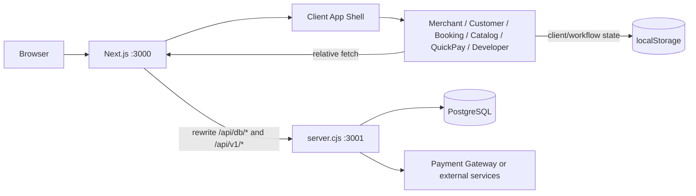
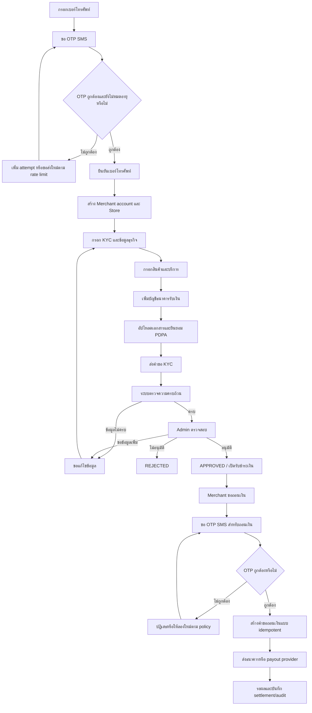

# ChatPOS Developer Guide

คู่มือนี้อธิบายว่า ChatPOS ทำอะไรได้บ้าง ระบบแบ่งส่วนอย่างไร และนักพัฒนาควรแก้หรือเพิ่มฟีเจอร์ตรงไหน เหมาะสำหรับทีมที่ทำงานกับ frontend, API, PostgreSQL และ workflow Merchant KYC

> สถานะปัจจุบัน: ChatPOS ใช้ Next.js เป็น frontend framework และมี custom API server แยกจาก Next.js. Session/authentication ของ API ใช้ server-side session ผ่าน HttpOnly cookie แล้ว แต่บาง workflow ด้านสินค้า บริการ การจอง และคำสั่งซื้อยังใช้ `localStorage` หรือ mock data จึงไม่ควรตีความว่าทุกฟีเจอร์เป็นระบบ production ที่มี persistence ครบแล้ว

## ภาพรวมความสามารถ

ChatPOS รวมความสามารถของระบบจัดการร้านค้าและการชำระเงินไว้ในชุดเดียว:

- สมัครและเข้าสู่ระบบสำหรับ Merchant, Agent, PD และ Admin ตามข้อมูลในฐานข้อมูล
- ลงทะเบียนร้านค้าแบบรวดเร็ว และกรอกข้อมูลธุรกิจ/เอกสาร KYC แบบ wizard
- Merchant back office สำหรับข้อมูลร้านค้า สินค้า บริการ การจอง หน้าขาย และช่องทางรับเงิน
- หน้าสั่งซื้อสำหรับลูกค้าในร้าน โต๊ะอาหาร delivery และ takeaway
- QuickPay/Cashier พร้อมสร้าง PromptPay QR และตรวจสอบสถานะธุรกรรม
- Developer Console สำหรับทดลอง API และดู webhook/developer logs
- Dashboard data จาก PostgreSQL เช่น ร้านค้า Agent, PD, KYC, ธุรกรรม สินค้า และค่าคอมมิชชัน
- โครงสร้างข้อมูลสำหรับเชื่อม Merchant, Agent, PD และสถานะ KYC

## สถาปัตยกรรม



### Frontend

- `src/app/layout.tsx` เป็น root layout ของ Next.js และโหลด global CSS ทั้งหมด
- `src/app/[[...slug]]/page.tsx` เป็น optional catch-all route จึงรับ URL เดิมได้หลายรูปแบบ
- `src/app/[[...slug]]/ClientApp.tsx` โหลด application shell แบบ client-only
- `src/App.tsx` อ่าน `window.location.pathname` แล้วเลือก view ที่เหมาะสม
- View แต่ละชุดอยู่ใน `src/*View.tsx` และ CSS อยู่ในไฟล์ `.css` คู่กัน
- `localStorage` ใช้เก็บ state ฝั่ง client บางส่วนของร้านค้า การจอง สินค้า หน้าขาย และ workflow อื่น ๆ; ไม่ใช้เป็น authority สำหรับ session หรือ API authorization
- Login ใช้ `HttpOnly` cookie ชื่อ `chatpos_session`; `src/App.tsx` hydrate user จาก `GET /api/db/auth/session` และ localStorage profile เป็นเพียง display cache

เหตุผลที่ใช้ client-only shell คือโค้ดเดิมอ่าน `window`, `document` และ `localStorage` ระหว่าง render/effect หากนำไป SSR โดยตรงจะเกิดปัญหา `window is not defined` หรือ hydration mismatch

### API server

`server.cjs` เป็น Node HTTP server แยกจาก Next.js ทำหน้าที่:

1. รับ request ที่ `/api/db/*` และ `/api/v1/*`
2. ตรวจ method และ route แบบ explicit
3. อ่าน body JSON และ query PostgreSQL ผ่าน `pg.Pool`
4. ตรวจ password ด้วย `bcryptjs` และสร้าง server-side session ใน login
5. บังคับ role, Store/Case ownership, rate limit, CORS และ secure headers ที่ API boundary
6. สร้าง PromptPay EMV payload และ QR data สำหรับ legacy payment flow เมื่อ feature flag อนุญาต
7. ส่ง signed commands/callbacks ระหว่าง ChatPOS กับ PD/Agent Backoffice และบันทึก audit/retry state
8. ส่ง JSON response กลับไปยัง browser

Next.js ไม่ได้ใช้ Route Handlers หรือ Server Actions สำหรับ API ในตอนนี้ แต่ใช้ rewrites ใน [`next.config.ts`](../next.config.ts) เพื่อส่ง request ไปยัง API process

### Database

การเชื่อมต่อใช้ PostgreSQL โดยตั้งค่าผ่าน environment variables:

- `DATABASE_URL` หากต้องการใช้ connection string
- หรือ `PGHOST`, `PGPORT`, `PGUSER`, `PGPASSWORD`, `PGDATABASE`
- `API_PORT` สำหรับพอร์ตของ custom API server ค่าเริ่มต้นคือ `3001`

อย่าใส่ password, token, PII หรือข้อมูลเอกสารจริงลงใน source control หรือ mock data

## การรันระบบ

### ข้อกำหนด

- Node.js 22 หรือรุ่นที่รองรับ Next.js ใน `package.json`
- npm
- PostgreSQL ที่เข้าถึงได้จากเครื่องหรือ container
- ไฟล์ `.env` ที่ตั้งค่าฐานข้อมูลและค่า integration ที่ต้องใช้

### ติดตั้งและพัฒนา

```bash
npm install
npm run dev
```

คำสั่ง `npm run dev` ใช้ `concurrently` เปิดสอง process พร้อมกัน:

- Next.js ที่ `http://localhost:3000`
- API server ที่ `http://localhost:3001`

เมื่อต้องการรัน API อย่างเดียว:

```bash
npm run server
```

เมื่อต้องการสร้างหรืออัปเดต schema ของ PostgreSQL:

```bash
npm run db:migrate
npm run db:seed
```

Migration หลักอยู่ที่ [`database/migrations/001_initial_chatpos_schema.sql`](../database/migrations/001_initial_chatpos_schema.sql) ถึง [`database/migrations/008_merchant_home_contract.sql`](../database/migrations/008_merchant_home_contract.sql) ครอบคลุมตาราง core ที่ `server.cjs` ใช้ รวมถึง Merchant KYC, assignment, profile/document version, server session, rate limit, audit, idempotency, webhook dedupe, settlement retry/dead-letter, document scan quarantine, OTP challenge persistence, Store-scoped Backoffice credential mapping และ Merchant Home capability/benefit/STOPPAY state. หลัง migration ให้ใช้ [`database/seed.cjs`](../database/seed.cjs) ผ่าน `npm run db:seed` เพื่อสร้างข้อมูลทดลองแบบ idempotent สำหรับทุก role และ workflow หลัก; ตั้ง `SEED_PASSWORD` ได้เมื่อต้องการเปลี่ยนรหัสผ่าน demo. ตารางเหล่านี้เป็น durable schema; client helper แบบ in-memory ยังใช้เฉพาะ unit test และไม่ควรใช้แทน persistence layer จริง

### Production

```bash
npm run build
npm run start
```

Dockerfile จะ build Next.js แล้วรันทั้ง Next.js และ API server ใน container เดียว โดยเปิดพอร์ต `3000` และ `3001` ควร route traffic ภายนอกไปที่พอร์ต `3000`

### ตรวจสอบโค้ด

```bash
npm run lint
```

`npm run build` ใช้ตรวจ production compilation และควรรันก่อน deploy หรือเมื่อแก้ routing/config ของ Next.js

## Environment variables

ค่าที่ใช้โดยโค้ดปัจจุบันมีดังนี้:

| Variable | ใช้โดย | ค่าเริ่มต้น/หมายเหตุ |
|---|---|---|
| `DATABASE_URL` | `server.cjs` | ใช้แทนชุด `PG*` ได้ |
| `PGHOST` | `server.cjs` | `127.0.0.1` หากไม่กำหนด |
| `PGPORT` | `server.cjs` | `5432` หากไม่กำหนด |
| `PGUSER` | `server.cjs` | `postgres` หากไม่กำหนด |
| `PGPASSWORD` | `server.cjs` | ว่างหากไม่กำหนด |
| `PGDATABASE` | `server.cjs` | `chatpos` หากไม่กำหนด |
| `API_PORT` | `server.cjs` | `3001` |
| `CHATPOS_API_URL` | `next.config.ts` | `http://127.0.0.1:3001` สำหรับ local API |
| `NEXT_PUBLIC_APP_URL` | application/deployment config | URL ภายนอกของเว็บ |
| `SESSION_SECRET` | legacy/config compatibility | ไม่ใช้แทน database session token; ห้ามใช้ค่า default ใน production |
| `KYC_DOCUMENT_LINK_SECRET` | `server/integration/documentAccess.cjs` | secret สำหรับ HMAC signed document URL; หากไม่กำหนดจะใช้ `SESSION_SECRET` เป็น fallback |
| `KYC_PRIVATE_STORAGE_ROOT` | `server/integration/privateDocumentStorage.cjs` | root ของ private document filesystem; ค่าเริ่มต้นคือ `private-storage` ใต้ working directory |
| `ALLOWED_ORIGINS` | `server.cjs` | exact comma-separated origins; ห้ามใช้ wildcard เมื่อเปิด credentials |
| `AUTH_LOGIN_RATE_LIMIT` / `AUTH_LOGIN_RATE_WINDOW_SECONDS` | `server.cjs` | login limit ต่อ IP/email bucket |
| `SETTLEMENT_RETRY_INTERVAL_MS` / `SETTLEMENT_MAX_ATTEMPTS` | `server.cjs` | durable settlement retry และ dead-letter policy |
| `DOCUMENT_SCANNER_URL` / `DOCUMENT_SCANNER_TOKEN` / `DOCUMENT_SCANNER_TIMEOUT_MS` | `server/integration/documentSecurity.cjs` | scanner ไม่พร้อมจะ quarantine เอกสาร ไม่ถือว่าสแกนผ่าน |
| `KYC_OTP_TTL_SECONDS` / `KYC_OTP_MAX_ATTEMPTS` / `KYC_OTP_RESEND_COOLDOWN_SECONDS` / `KYC_OTP_LOCK_SECONDS` | `server/integration/otpService.cjs` | policy ของ local KYC challenge; SMSUP adapter รองรับการส่งและตรวจ OTP เมื่อ `SMS_OTP_ENABLED` และ provider readiness เปิด |
| `KYC_DOCUMENT_INTAKE_ENABLED` | `server.cjs` / `server/integration/signedMerchantClient.cjs` | gate ของการส่ง KYC document metadata ไปยัง PD/Agent Backoffice; ค่า default เป็น `false`, production ปัจจุบันเป็น `true` |
| `KYC_DOCUMENT_LINK_TTL_SECONDS` | `server/integration/signedMerchantClient.cjs` | อายุ signed document download URL; `86400` เท่ากับ 24 ชั่วโมง |
| `AGENT_PD_INTEGRATION_ENABLED` / `AGENT_PD_ASSIGNMENT_ENABLED` / feature flags อื่น | `server.cjs` / integration services | ค่า static ระดับ deployment สำหรับเปิด-ปิด capability; ไม่ใช่ credential หรือ Store mapping |
| `AGENT_PD_CREDENTIAL_ENVIRONMENT` / `AGENT_PD_KEY_ID_HEADER` | `server/integration/storeBackofficeCredentials.cjs` / signed client | environment ที่ใช้เลือก mapping และชื่อ header Key ID ซึ่งเป็นค่า static ของ deployment |
| `backoffice_store_credentials` | `server/integration/storeBackofficeCredentials.cjs` | dynamic mapping ต่อ Store และ environment; เก็บ Base URL, Backoffice Store ID, Key ID และ secret reference เท่านั้น ไม่เก็บ secret จริง |
| `CHATPOS_BACKOFFICE_BEARER_SECRET` / `CHATPOS_BACKOFFICE_SIGNING_SECRET` | `server/integration/signedMerchantClient.cjs` และ `storeBackofficeCredentials.cjs` | ใช้เป็น runtime secret ปกติจาก server environment/secret manager สำหรับ outbound request; ห้ามส่งเข้า browser |
| `CHATPOS_BACKOFFICE_CALLBACK_SECRET` | `server/integration/storeBackofficeCredentials.cjs` ผ่าน `callbackSecretRef` | ใช้ตรวจ callback จาก Backofficeเมื่อเลือก `env:` reference; ค่าเริ่มต้น `db:encrypted` จะรับ `webhookSecret` จาก request แรกแล้วเก็บแบบเข้ารหัสใน DB |
| `LLGW_PAYMENT_WEBHOOK_ENABLED` | `server.cjs` | local LLGW receiver ปิดเป็นค่าเริ่มต้น; อย่าเปิดจนกว่า ownership/exception จะได้รับอนุมัติ |
| `AGENT_PD_SIGNING_SECRET_PREVIOUS` / `AGENT_PD_CALLBACK_SECRET_PREVIOUS` | signed PD/Agent Backoffice integration | รับ secret เดิมชั่วคราวระหว่าง rotation แล้วต้องลบเพื่อ revoke |
| `LLGW_PAYMENT_WEBHOOK_SECRET_PREVIOUS` | LLGW webhook verification | รับ secret เดิมชั่วคราวระหว่าง rotation แล้วต้องลบเพื่อ revoke |
| `PAYMENT_STATUS_WEBHOOK_ENABLED` | normalized payment-status callback receiver | ปิดเป็นค่าเริ่มต้นจนกว่า external contract และ staging evidence จะผ่าน |
| `PAYMENT_STATUS_WEBHOOK_SECRET(_PREVIOUS)` | normalized payment-status callback verification | secret manager เท่านั้น; รองรับ rotation ชั่วคราว |
| `PAYMENT_STATUS_TIMESTAMP_TOLERANCE_SECONDS` | normalized payment-status callback verification | ค่าเริ่มต้น 300 วินาที |
| `MERCHANT_HOME_CONTRACT_ENABLED` | `server.cjs` | gate ของ Home read model, capabilities, benefits, notifications และ STOPPAY routes; ค่าเริ่มต้น `false` |
| `TRANSACTION_ROUTING_ENABLED` / `TRANSACTION_QUERY_ROUTING_ENABLED` | `server/integration/transactionService.cjs` | forward payment command และ query ไป Backoffice แบบ opt-in; ปิดเป็นค่าเริ่มต้น |
| `AGENT_PD_TRANSACTION_COMMAND_PATH` / `AGENT_PD_TRANSACTION_QUERY_PATH` | signed Backoffice client | path placeholder ที่ต้องตรงกับ signed contract ก่อนเปิด routing |

`.env.example` ยังมีตัวแปรชื่อ `VITE_API_URL` และ `VITE_APP_ENV` จากยุค Vite เดิม ซึ่งไม่ใช่ตัวแปรที่ Next routing ชุดปัจจุบันอ่านโดยตรง ให้ใช้ `CHATPOS_API_URL` และ `NEXT_PUBLIC_APP_URL` เป็นหลัก

ใน `.env.production` เปิด `AGENT_PD_INTEGRATION_ENABLED`, `KYC_DOCUMENT_INTAKE_ENABLED` และ `KYC_DOCUMENT_LINK_TTL_SECONDS="86400"` แล้ว ส่วน `CHATPOS_API_URL="http://127.0.0.1:3001"` เป็น URL ภายในระหว่าง Next.js กับ custom API server; URL ภายนอกสำหรับลิงก์ที่ผู้ใช้เปิดคือ `NEXT_PUBLIC_APP_URL` ไม่ใช่ loopback address. ห้ามใส่ Base URL, Backoffice Store ID, Key ID หรือค่า credential ต่อ Store ลง `.env`; ให้ provision ลง `backoffice_store_credentials` เท่านั้น

## Frontend routes

ทุก URL เข้ามาที่ catch-all route แล้ว `src/App.tsx` เป็นผู้เลือก view ตาม pathname:

| URL pattern | View | หน้าที่ |
|---|---|---|
| `/`, `/login`, `/landing` | `LandingPageView` | landing และ login |
| `/merchant`, `/merchant/*` | `MerchantView` | merchant back office |
| `/merchant/register`, `/register` | `MerchantRegistrationView` | สมัครร้านค้าและ KYC wizard |
| `/booking`, `/book`, `/services`, `/appointment` | `BookingPageView` | หน้าจองบริการ |
| `/catalog*`, `/sales*`, `/page/*`, `/sp/*` | `CatalogPageView` | catalog และ sales page |
| `/customer`, `/order`, `/delivery`, `/takeaway`, `/c/*`, `/t*` | `CustomerView` | สั่งซื้อและโต๊ะอาหาร |
| `/shop`, `/quickpay`, `/pay`, `/kiosk`, `/display`, `/s/*` | `QuickPayView` | cashier และ payment link |
| `/developer/*` | `DeveloperConsoleView` | API playground สำหรับ user ที่ login แล้ว |

เมื่อเพิ่ม route ใหม่ ให้ตรวจลำดับเงื่อนไขใน `src/App.tsx` ด้วย เพราะ route ที่ใช้ `startsWith()` อาจครอบคลุม pathname อื่นโดยไม่ตั้งใจ

## ความสามารถตาม workflow

### Merchant onboarding และ KYC

ปัจจุบัน frontend รองรับแนวคิดการสมัครเป็นสองช่วง:

1. สมัครเปิดร้านค้าเริ่มต้นแบบรวดเร็ว
2. กรอกข้อมูลธุรกิจและเอกสาร KYC แบบละเอียด

ข้อมูลที่ workflow รองรับในระดับ UI/API ได้แก่ข้อมูลผู้สมัคร ร้านค้า ประเภทธุรกิจ เลขประจำตัว บัญชีธนาคาร เอกสาร และ consent/PDPA ตาม `registrationI18n.ts` และ `MerchantRegistrationView.tsx`

API ที่เกี่ยวข้อง:

- `POST /api/db/auth/register-merchant`
- `POST /api/v1/assignments/requests` สำหรับส่งคำขอผูก Agent ผ่าน signed server-side client
- `POST /api/webhooks/assignment-status` สำหรับรับ signed status callback จาก Backoffice
- `GET /api/db/assignments` สำหรับอ่านสถานะ assignment ของ Store
- `PATCH /api/v1/stores/profile` สำหรับแก้ profile ผ่าน signed server-side client และ optimistic concurrency
- `POST /api/v1/kyc/cases/{caseId}/documents` สำหรับเพิ่ม KYC document version แบบ immutable
- `GET /api/db/kyc/workspace` สำหรับอ่าน case, document timeline, notifications และ chat
- `POST /api/db/kyc/cases/{caseId}/messages` สำหรับ append-only KYC Chat/Post
- `PATCH /api/db/kyc/cases/{caseId}/messages/{messageId}/read` สำหรับ read status
- `GET /api/db/kyc/documents/{versionId}/access` สำหรับตรวจ private document locator ตาม Store context
- `GET /api/db/kyc`
- `POST /api/db/kyc/update-status`

ระบบรองรับ `GET /api/v1/kyc/documents/{versionId}/download?token=...` สำหรับ signed download URL แล้ว โดย `POST /api/v1/kyc/cases/{caseId}/documents` รับ binary body ของไฟล์ พร้อม `X-KYC-File-Name`, `X-KYC-Document-Type` และ `X-KYC-Reason` ที่ encode ด้วย `encodeURIComponent`. Server คำนวณ SHA-256 เอง, สร้าง locator รูป `private/kyc/...` ที่ผูกกับ Store, Case และ idempotency request, เขียนไฟล์แบบไม่ overwrite และส่ง payload 7 fields ตาม Section 7 ของ Client Integration Guide ไปกับ command ของ PD/Agent ได้แก่ `documentId`, `documentType`, `version`, `checksumSha256`, `storageLocator`, `sourceIssuedAt` และ `sourceRequestId`; ห้ามส่ง `documentUrl` หรือ `documentUrlExpiresAt`. Backoffice ต้องตั้งค่า storage base URL/allowed origin ให้ resolve locator นี้ไปยัง private storage ของระบบหลักตาม contract. Token ผูกกับ `versionId` และ Store, หมดอายุตาม `KYC_DOCUMENT_LINK_TTL_SECONDS` ซึ่ง production ตั้งเป็น `86400` วินาที (24 ชั่วโมง); download จะตรวจ signature, expiry, scan status, ขนาด และ checksum พร้อมบันทึก audit

Phase 2 มี assignment service ใน `server/integration/assignmentService.cjs` ซึ่งบันทึก request และ event history แบบ durable, ใช้ idempotency ตาม `storeId + sourceRequestId`, ตรวจ callback ด้วย raw body และ HMAC แบบ constant-time และเปลี่ยน `Store.currentAgentId`/`Store.currentPdId` เฉพาะ callback สถานะ `ACCEPTED` ที่ resolve Agent และ PD ที่ active ได้เท่านั้น สถานะ `REJECTED`, `EXPIRED` และ `REASSIGNED` จะไม่ทำให้ Store ถูกผูก Agent ต่อ ส่วน callback ซ้ำหรือ callback ที่มาช้ากว่าจะถูก dedupe/ignore ใน transaction เดียวกับ state update

Merchant portal แสดงสถานะ `PENDING_ADMIN_ASSIGNMENT`, `PENDING_AGENT_ACCEPTANCE`, `ACCEPTED`, `REJECTED`, `EXPIRED` และ `REASSIGNED` พร้อม next action และจะแสดง Agent/PD เฉพาะเมื่อ status เป็น `ACCEPTED` การสมัคร Merchant จะส่ง assignment request หลังสร้าง Store สำเร็จ โดยรองรับทั้งการระบุเบอร์ Agent และการเว้นว่างให้ Admin จัดสรร หาก `AGENT_PD_INTEGRATION_ENABLED` หรือ `AGENT_PD_ASSIGNMENT_ENABLED` ยังปิดอยู่ การสมัครบัญชียังสำเร็จแต่จะไม่ forward assignment ไป Backoffice

Phase 2 command/callback ใช้ `storeId` จาก server-side authorization เพื่อ resolve mapping ใน `backoffice_store_credentials`; ไม่มี global Store/credential fallback และ request ที่ไม่มี active mapping จะถูกปฏิเสธแบบ fail-closed. Browser request ใช้ server session และ API ตรวจ Store/Case ownership จากฐานข้อมูล; `X-Store-Id`, `X-Actor-Id` และ `X-Actor-Role` ไม่ได้รับความเชื่อถือและไม่อยู่ใน CORS allowlist แล้ว. ต้องทดสอบ command/callback กับ PD/Agent Backoffice staging จริง รวมถึง receiver downtime, secret rotation และ retry recovery

Phase 3 เพิ่ม `profileKycService.cjs` สำหรับ profile update, KYC document intake และ KYC Chat/Post โดย profile รับเฉพาะ nested `profile` allowlist ตาม contract, ใช้ `expectedProfileVersion`, `Idempotency-Key` และ snapshot ใน `merchant_profile_versions`; conflict ตอบ `PROFILE_VERSION_CONFLICT` และ replay ของ payload เดิมไม่เพิ่ม version ซ้ำ การแก้ field ที่กระทบ KYC จะเก็บ submission snapshot เดิมแบบไม่ overwrite, เปลี่ยน case เป็น `WAITING_AGENT_REVIEW`, อัปเดต `KycVerification`, สร้าง notification ให้ Agent และเขียน audit

Document intake ตรวจ document type ตาม allowlist ใน Section 7 ของ guide, MIME (`application/pdf`, `image/jpeg`, `image/png`, `image/webp`), ขนาดไม่เกิน 10 MB, SHA-256 checksum และ `private/kyc/` locator เท่านั้น พร้อม unique `caseId + sourceRequestId`, `caseId + idempotencyKey`, `documentId + version` และ `documentId + checksum` เพื่อป้องกัน replay, overwrite และการใช้ version เดิมกับไฟล์ใหม่ การแก้เอกสารจึงต้องส่ง request ใหม่พร้อม source request ใหม่เสมอ โดย `sourceIssuedAt` ถูก persist ใน version เพื่อให้ idempotent replay ใช้ payload เดิม ส่วน Chat/Post เก็บข้อความและ attachment metadata แบบ append-only และรองรับ read status

Phase 3 ยังเป็น feature-flagged integration: `MERCHANT_PROFILE_UPDATE_ENABLED` และ `KYC_DOCUMENT_INTAKE_ENABLED` ปิดเป็นค่าเริ่มต้น แต่ production ปัจจุบันเปิด `KYC_DOCUMENT_INTAKE_ENABLED=true`; route command จะ forward ผ่าน signed PD/Agent Backoffice client เมื่อเปิด flag เท่านั้น. Document intake รับ binary ผ่าน API, ตรวจ MIME/size/checksum, เก็บไฟล์ใน private filesystem adapter, เรียก scanner adapter และเก็บ `scanStatus`; scanner ที่ไม่มีหรือไม่พร้อมจะทำให้ version อยู่ในสถานะ quarantine และทั้ง access metadata กับ signed download จะไม่เปิดจนกว่าจะเป็น `CLEAN`. Signed URL ตรวจ signature, Store scope, expiry และ file integrity ก่อนส่งไฟล์ พร้อม audit การเปิดอ่าน; production ยังต้องยืนยัน private storage ที่เข้ารหัส, scanner service, Store credential mappings, staging replay/conflict และ Agent review -> PD/Compliance final decision

ข้อควรเข้าใจ: โค้ดปัจจุบันมี assignment, KYC Chat/Post, immutable document versions, server session, role/Store/Case authorization และ audit/retry foundations แล้ว แต่ยังไม่ใช่ implementation เต็มรูปแบบของ Merchant KYC ที่ผ่าน staging, PostgreSQL E2E, storage encryption/scanner verification, multi-level approval sign-off และ production operations ครบทุกขั้น หากพัฒนาต่อให้ใช้ skill [`merchant-kyc`](../.github/skills/merchant-kyc/SKILL.md) เป็นข้อกำหนด workflow

กฎ domain ที่ต้องรักษา:

- Agent ตรวจสอบเบื้องต้นและส่งต่อได้ แต่ไม่อนุมัติขั้นสุดท้ายคนเดียว
- เอกสารใหม่ต้องเป็น version ใหม่ ห้ามเขียนทับหลักฐานเดิม
- การขอข้อมูลเพิ่มควรเชื่อมกับ case และเอกสารที่ต้องแก้
- ทุก status transition สำคัญต้องเก็บ actor, เวลา, เหตุผล และ audit event
- ข้อมูลบัตรประชาชนและบัญชีธนาคารต้อง mask เมื่อไม่จำเป็นต้องแสดงเต็ม

### Flow สมัคร Merchant ตั้งแต่ OTP ถึงเปิดใช้งาน

Flow นี้เป็นลำดับมาตรฐานสำหรับ Merchant registration, KYC, ข้อมูลร้านค้า, สินค้า/บริการ, บัญชีรับเงิน และการอนุมัติ โดยแยกส่วนที่มีอยู่ใน prototype ปัจจุบันออกจากส่วนที่ต้องทำต่อเป็น production workflow



#### 1. สมัครและยืนยันเบอร์ด้วย OTP SMS

1. Merchant กรอกเบอร์โทรศัพท์และระบบ normalize เป็นรูปแบบมาตรฐานก่อนตรวจซ้ำ
2. ระบบสร้าง OTP ตาม `purpose` เช่น `merchant_registration`, `change_phone` หรือ `withdrawal` และผูกกับเบอร์, session/request ID และวันหมดอายุ
3. ระบบเก็บเฉพาะ hash ของ OTP ไม่เก็บรหัสจริงใน database หรือ log แล้วส่งรหัสผ่าน SMS provider
4. จำกัดการขอส่งใหม่และจำนวนครั้งที่กรอกผิด เช่น cooldown ต่อเบอร์/IP/device และ lock ชั่วคราวเมื่อเกินจำนวนครั้ง
5. เมื่อกรอกรหัสถูกต้อง ระบบต้องตรวจ `purpose`, expiry, attempt, nonce และสถานะ `used` ก่อน mark เป็นใช้แล้วเพียงครั้งเดียว
6. หลังยืนยันสำเร็จให้บันทึก `phoneVerifiedAt` และออก registration session/server-side token ห้ามถือว่าแค่ส่ง OTP สำเร็จคือยืนยันตัวตนแล้ว
7. การส่ง OTP ซ้ำต้อง invalidate OTP เดิมตาม policy และห้ามส่งรหัสผ่าน query string, browser storage หรือ log

KYC case SMS/OTP ปัจจุบันมี SMSUP adapter ใน [`server/integration/smsupClient.cjs`](../server/integration/smsupClient.cjs), local challenge persistence และ routes ใน [`server.cjs`](../server.cjs) โดยเปิดใช้งานเมื่อ `SMS_OTP_ENABLED=true`, `SMS_OTP_PROVIDER_READY=true` และ `SMS_PROVIDER=smsup_plus`. ต้องทำ real delivery/verification E2E, ตรวจการหมุน credential และยืนยัน owner/contract กับ PD/Agent ให้ครบก่อนถือว่าเป็น production-ready

#### 2. สร้างบัญชี Merchant และข้อมูลร้านค้า

หลังยืนยัน OTP สำเร็จ Merchant กรอก email, password, ชื่อผู้สมัคร, ชื่อร้าน, ประเภทร้าน, เบอร์ที่ยืนยันแล้ว และข้อมูลติดต่อ ระบบควรทำใน transaction เดียว:

- สร้าง `User` ด้วย role `owner` หรือ `merchant`
- สร้าง `Store` และผูกกับ `User`
- สร้าง `MerchantIdentity` สำหรับ merchant ID ที่ระบบออกให้
- สร้าง `KycVerification` หรือ `merchant_kyc_cases` สถานะเริ่มต้น `draft`
- บันทึก consent version และ audit event ของการสมัคร

API ปัจจุบันคือ `POST /api/db/auth/register-merchant` และบันทึก `User`, `Store`, `MerchantIdentity` และ `KycVerification` แต่ยังไม่ได้บังคับ KYC case OTP ก่อนสร้างบัญชีอย่างสมบูรณ์; OTP routes ปัจจุบันใช้กับ case ที่มีอยู่แล้วและจำกัด Merchant role. การบังคับ OTP ใน registration ต้องมี policy และ contract แยกต่างหาก รวมถึงยืนยัน transaction rollback, email/phone uniqueness, abuse controls และ staging authorization ก่อนใช้ production

#### 3. กรอก KYC และข้อมูลธุรกิจ

Merchant เลือกประเภทกิจการและกรอกข้อมูลตามลำดับ ไม่ควรใช้ form เดียวที่ไม่มี business rule:

1. ข้อมูลเจ้าของกิจการหรือข้อมูลนิติบุคคล
2. ชื่อร้าน ประเภทธุรกิจ ที่อยู่ สาขา พิกัด และช่องทางการขาย
3. สินค้า/บริการหลัก รูปแบบการดำเนินงาน ยอดขายโดยประมาณ และวัตถุประสงค์การรับเงิน
4. ข้อมูลบัญชีธนาคารรับเงิน
5. เอกสาร KYC ที่ตรงกับประเภทกิจการ
6. ตรวจทานข้อมูล, consent/PDPA และ submit

เลขบัตรประชาชน, เลขทะเบียนนิติบุคคล, เลขบัญชี และเอกสารต้อง mask เมื่อแสดงผล ใช้ private storage สำหรับไฟล์ และสร้าง document version ใหม่ทุกครั้งที่ส่งแก้ไข ห้าม overwrite version เดิม

สถานะที่ควรใช้:

`draft` -> `ready_for_submission` -> `pending_admin_review` -> `needs_more_info` -> `approved` หรือ `rejected`

หากใช้ Agent/PD workflow ร่วมด้วย ให้ Agent ตรวจสอบเบื้องต้นและส่งต่อ ส่วน PD/Compliance หรือผู้มีอำนาจเป็นผู้อนุมัติขั้นสุดท้าย ไม่ให้ Agent กดอนุมัติแทน

#### 4. ลงข้อมูลร้านค้า สินค้า และบริการ

ข้อมูลร้านค้าเป็น profile ของ Store ส่วนสินค้าและบริการเป็นข้อมูลที่ Merchant ใช้เปิดขายจริง ควรแยกสถานะและ audit ออกจาก KYC:

- ร้านค้า: ชื่อร้าน, ที่อยู่, เบอร์, ประเภทร้าน, เวลาเปิด-ปิด, ช่องทางขาย และสถานะเปิดใช้งาน
- สินค้า: ชื่อ, SKU, หมวดหมู่, รายละเอียด, ราคาขาย, ต้นทุน, stock, รูปภาพ และสถานะ active
- บริการ: ชื่อบริการ, รายละเอียด, ราคา, ระยะเวลา, จำนวนคิว/slot, เงื่อนไขการจอง และสถานะ active

ตาราง `Product` มีอยู่ใน migration และถูกใช้โดย `/api/db/products` แล้ว ส่วนข้อมูลบริการและตารางเวลาปัจจุบันยังมีส่วนที่อยู่ใน prototype/localStorage จึงควรเพิ่มตาราง service/availability เมื่อจะรองรับหลายอุปกรณ์หรือ production

กติกาการบันทึก:

- Merchant แก้ไขเฉพาะ Store ของตนเอง
- การเปลี่ยนข้อมูลที่กระทบ KYC ต้องสร้าง profile version ใหม่และส่ง review ตาม policy
- การแก้สินค้า/บริการไม่ควรแก้ทับประวัติราคา/สถานะที่จำเป็นต่อการตรวจสอบ transaction
- ห้ามเปิดขายสินค้า/บริการก่อน Store ผ่านสถานะที่ policy อนุญาต

#### 5. ลงข้อมูลบัญชีธนาคารสำหรับรับเงิน

1. Merchant เลือกธนาคารและกรอกเลขบัญชี, ชื่อบัญชี และประเภทบัญชี
2. ระบบตรวจ format และตรวจว่าชื่อบัญชีสอดคล้องกับเจ้าของกิจการ/นิติบุคคลตาม policy
3. Merchant อัปโหลดหน้าสมุดบัญชีหรือเอกสารยืนยันผ่าน private upload
4. ระบบเก็บ checksum, MIME, size, storage locator และ document version; ไม่เก็บ public URL หรือไฟล์ base64 ใน record
5. สถานะบัญชีควรเป็น `pending_verification`, `verified`, `rejected`, `suspended` หรือ `change_requested`
6. การเปลี่ยนบัญชีหลัง verified ต้องทำเป็นบัญชี/เวอร์ชันใหม่, ส่ง OTP ที่เบอร์ verified และอาจต้อง Admin review ใหม่
7. ห้ามให้ Merchant ถอนเงินไปยังบัญชีที่ยังไม่ verified และห้ามให้ frontend เป็นผู้ตัดสินสถานะเอง

prototype ปัจจุบันเก็บข้อมูลบางส่วนใน `Store.payoutBankName`, `Store.payoutAccountNumber`, `Store.payoutAccountName` และ `KycVerification` แต่ยังควรแยกเป็น `merchant_bank_accounts` และ `merchant_bank_account_versions` เพื่อรองรับหลายบัญชี, verification history, masking, replacement และ audit อย่างถูกต้อง

#### 6. ขั้นตอนการอนุมัติโดย Admin ระบบ

เมื่อ Merchant กด submit ระบบต้องสร้าง submission snapshot และเปลี่ยนสถานะใน transaction เดียว จากนั้น Admin ทำงานตามลำดับ:

1. ตรวจว่า OTP/เบอร์, ข้อมูลบังคับ, consent, เอกสาร และบัญชีรับเงินครบ
2. ตรวจ duplicate Merchant, risk flag, ชื่อบัญชีธนาคาร และความสอดคล้องของเอกสาร
3. เปิดดูข้อมูลเท่าที่ role มีสิทธิ์ และบันทึกทุก access/download ที่เป็นข้อมูลอ่อนไหว
4. เลือก action ได้เฉพาะตามสถานะ: `request_more_info`, `approve`, `reject`, `hold`
5. ทุก action ต้องมี actor, timestamp, reason, before/after และ request/correlation ID
6. ถ้าขอข้อมูลเพิ่ม ให้เปลี่ยนเป็น `needs_more_info` และระบุ field/document ที่ต้องแก้ ไม่ลบ submission เดิม
7. ถ้าอนุมัติ ให้เปลี่ยนเป็น `approved`, เปิด feature ที่ policy อนุญาต และส่ง notification
8. ถ้าปฏิเสธ ให้เก็บเหตุผลที่แสดงแก่ Merchant แยกจาก risk rule ภายใน และห้ามเปลี่ยนเป็น approved ผ่าน frontend โดยตรง

API ปัจจุบันมี `GET /api/db/kyc` และ `POST /api/db/kyc/update-status`; route status จำกัดไว้ที่ Compliance/Admin, ใช้ server session และเขียน before/after audit. ยังต้องเพิ่ม/ยืนยัน transition guard, review checklist, PostgreSQL permission matrix และ final approval policy ก่อน production

#### 7. ขั้นตอนการขอถอนเงินผ่าน OTP SMS

1. Merchant เปิดหน้ากระเป๋าเงิน ระบบอ่าน available balance และตรวจว่า Store/บัญชีธนาคาร/สถานะ KYC ผ่านเงื่อนไข
2. Merchant ระบุจำนวนเงินและบัญชีปลายทาง ระบบตรวจ minimum/maximum, fee, balance, pending withdrawal และ ownership ของบัญชี
3. Merchant กดขอถอน ระบบสร้าง withdrawal intent ที่ยังไม่ส่ง payout และส่ง OTP ไปยังเบอร์โทรศัพท์ที่ verified เท่านั้น
4. OTP ต้องผูกกับ `withdrawalId`, amount, destination account version และ `purpose=withdrawal`; หากเปลี่ยนยอดหรือบัญชีต้องยกเลิก OTP เดิมและสร้าง intent ใหม่
5. Merchant กรอก OTP ระบบตรวจ hash, expiry, attempts, used state และ lock policy จาก server
6. เมื่อยืนยันสำเร็จ ระบบทำ idempotent command ด้วย `Idempotency-Key` เดิมของ withdrawal intent แล้วส่งไป payout provider/Backoffice
7. เปลี่ยนสถานะเป็น `processing` และส่งผลผ่าน webhook/reconciliation เป็น `completed`, `failed`, `reversed` หรือ `cancelled`
8. บันทึก audit, OTP verification result, provider reference, fee, amount และบัญชีเวอร์ชันที่ใช้ โดย mask เลขบัญชีในทุก log/หน้าจอ

ห้ามสร้าง payout จาก frontend โดยตรง, ห้ามถือว่า response `200` คือเงินเข้าบัญชีแล้ว และห้ามสร้าง withdrawal ใหม่เมื่อ request เดิม timeout ก่อนรู้ผล ให้ตรวจสถานะด้วย `withdrawalId`/idempotency key เดิม

ปัจจุบัน `POST /api/v1/payouts` ใน `server.cjs` ยังเป็น prototype ที่คืนสถานะ `processing` และยังไม่มี OTP SMS, durable withdrawal record, provider integration หรือ settlement reconciliation ดังนั้น flow ถอนเงินจริงยังต้อง implement เพิ่มก่อนเปิด feature

#### สถานะ implementation ของ flow นี้

| ขั้นตอน | สถานะปัจจุบัน | จุดที่ต้องทำต่อก่อน production |
|---|---|---|
| KYC case OTP ผ่าน PD/Agent | มี route, challenge persistence, TTL, attempt limit, resend cooldown, lock, audit foundation และ SMSUP adapter | ทำ real SMSUP delivery/verification E2E และยืนยัน owner/contract กับ PD/Agent ก่อน production |
| สร้าง Merchant/Store/KYC | มี `POST /api/db/auth/register-merchant`, core tables และ server session สำหรับ login | บังคับ OTP, transaction boundary, validation และ staging authorization |
| KYC document/version | มี API, checksum, immutable version, private locator, quarantine/scanner status และ access audit | ต่อ private binary upload, signed download อายุ 24 ชั่วโมง, scanner จริง, encryption at rest, review queue และ PostgreSQL E2E |
| สินค้า | มี `Product` และ `/api/db/products` | ownership, validation, history และ production authorization |
| บริการ | ส่วนใหญ่ยังเป็น prototype/localStorage | service/availability schema และ API persistence |
| บัญชีรับเงิน | มี field ใน `Store`/`KycVerification` | dedicated account/version tables, verification และ change control |
| Admin approval | endpoint จำกัด Compliance/Admin และมี before/after audit | transition guard, checklist, decision policy และ final approval evidence |
| ถอนเงิน | มี prototype `/api/v1/payouts` | OTP, withdrawal ledger, idempotency, provider webhook และ reconciliation |

### Merchant back office

`MerchantView.tsx` รวมความสามารถหลายกลุ่มไว้ใน dashboard เดียว เช่น:

- ดูสถานะร้านค้าและ KYC
- จัดการสินค้า หมวดหมู่ สต็อก และราคา
- จัดการบริการและตารางจอง
- สร้าง/แก้ sales page และ catalog
- สร้างลิงก์หรือ QR สำหรับช่องทางขาย
- ดูคำสั่งซื้อ รายการชำระเงิน และการจ่ายเงิน
- ตั้งค่าโปรไฟล์และ integration settings ที่เปิดให้ Merchant ใช้

ข้อมูล operational prototype หลายรายการยังเก็บใน `localStorage` และ sync ระหว่างหน้าด้วย `storage` event จึงควรย้ายไป API/database เมื่อทำระบบหลายผู้ใช้หรือ production. Session, API authorization และ integration secret ไม่อยู่ใน localStorage

### Customer ordering

`CustomerView.tsx` รองรับการเลือกสินค้า จัดการตะกร้า ส่งคำสั่งซื้อ เรียกพนักงาน และแยก context ของโต๊ะ/ช่องทาง เช่น delivery หรือ takeaway ข้อมูลคำสั่งซื้อบางส่วนใช้ key ใน `localStorage` เช่น `cust_orders_*` และ `merchant_live_orders`

### Booking และ digital catalog

- `BookingPageView.tsx` แสดงบริการ เวลา และสร้างรายการจอง
- `CatalogPageView.tsx` แสดงหน้าขาย/catalog ที่อ้างอิง slug และข้อมูลที่ merchant บันทึกไว้
- `MerchantView.tsx` เป็นจุดจัดการข้อมูลบริการ หน้าขาย และ QR/link

### External Backoffice contract กับ local ChatPOS implementation

[CHATPOS Client Integration Guide](CHATPOS_CLIENT_INTEGRATION_GUIDE.md) เป็น external target contract สำหรับ partner และต้องไม่ถูกตีความว่า endpoint ภายนอกถูก deploy หรือได้รับ sign-off ใน local repository แล้ว. [PHASE_0_CONTRACT_DECISION_RECORD.md](PHASE_0_CONTRACT_DECISION_RECORD.md) เป็นบันทึกขอบเขต/decision ที่มีอยู่ใน repository ส่วนสถานะงาน, owner และ external dependency ให้ติดตามใน [NEXT_STEPS_CHECKLIST.md](NEXT_STEPS_CHECKLIST.md); ก่อนหน้านี้มีการอ้างชื่อ `CHATPOS_INTEGRATION_HANDOFF.md` แต่ไฟล์ดังกล่าวไม่มีอยู่ใน repository ปัจจุบัน จึงไม่ควรใช้เป็นลิงก์อ้างอิงที่ทำงานไม่ได้

ก่อนเปิด feature หรือเปลี่ยน route ให้มี signed contract matrix จาก Backoffice ที่ยืนยัน endpoint, payload, scope, Store/amount ownership, response/error, idempotency, callback URL, signature, retry และ webhook owner ก่อนเสมอ ห้ามเปลี่ยน local implementation ให้เดาตามตัวอย่างใน guide เพียงอย่างเดียว

| พื้นที่ | External target ใน Integration Guide | Local ChatPOS ที่มีใน repository | งานที่ต้องทำต่อ |
|---|---|---|---|
| Merchant Home | ไม่ใช่ signed partner route; เป็น authenticated product surface ของ ChatPOS | Browser เรียก `/api/db/home` และ Home subroutes ด้วย `chatpos_session`; ถูก gate ด้วย `MERCHANT_HOME_CONTRACT_ENABLED` | ตรวจ PostgreSQL permission matrix, Store switching, browser evidence และเปิด flag หลัง rollout gate |
| Payment command | Candidate `POST /api/v1/transactions/{id}/payment`; Backoffice derive payment context และส่งต่อ LLGW | Browser เรียก local `POST /api/v1/transactions`; server ส่ง payload ผ่าน `AGENT_PD_TRANSACTION_COMMAND_PATH` ซึ่ง default เป็น `/api/v1/transactions` | รอ Backoffice ยืนยัน path/payload แล้วทำ adapter, contract test และ staging E2E; outbound path config ไม่ได้สร้าง external route ใน local server |
| Merchant callback receiver | Merchant/partner ต้องลงทะเบียน callback URL กับ Backoffice | มี local `/api/webhooks/assignment-status` และ `/api/webhooks/payment-status` สำหรับคนละ callback boundary | ยืนยัน callback owner, event schema, secret และ retry contract ก่อน map external URL กับ receiver ใด ๆ |
| LLGW pay-in webhook | Target ให้ PD/Agent รับ LLGW, verify/dedupe/update payment state | ChatPOS มี local `POST /api/webhooks/llgw/payment` แต่ gate ด้วย `LLGW_PAYMENT_WEBHOOK_ENABLED=false` เป็นค่าเริ่มต้น | ยืนยัน ownership หรือ architecture exception ก่อนเปิด receiver ใน environment ใด ๆ |
| Normalized payment status | PD/Agent ส่ง signed payment-status webhook และเปิด status query ให้ partner | ChatPOS มี gated receiver ที่ `POST /api/webhooks/payment-status` และ signed payment query adapter; ทั้งคู่ปิดเป็นค่าเริ่มต้น | ยืนยัน event schema/path/secret/retry แล้วเปิดใช้ใน staging, เพิ่ม reconcile และ retire/exception local LLGW receiver |
| KYC phone OTP | Target มี Backoffice `/otp` และ `/otp/verify` ให้ Backoffice สร้าง/verify challenge | ChatPOS มี Merchant-only KYC case routes, PostgreSQL challenge persistence และ fail-closed provider stub; ยังไม่มี provider adapter จริง | ยืนยัน external OTP contract, SMS readiness, lock policy และทำ staging delivery E2E ก่อนเปิด |
| Commission settlement | Partner ส่ง signed settlement fact ไปยัง Backoffice-provided destination URL | ChatPOS สร้าง durable settlement event และ dispatch ไป `COMMISSION_EVENT_SOURCE_URL`; ไม่มี inbound `/api/webhooks/commission/settlement` route | ยืนยัน Finance mapping/destination และทดสอบ retry/dead-letter/reconciliation |

### Merchant Home local contract

Merchant Home เป็น authenticated product surface ที่ `/merchant#home` และต้องแยกจาก public landing ที่ `/`. UI ใช้ relative `/api/db/*` พร้อม HttpOnly `chatpos_session`; ไม่ใช้ external signed `/api/v1` contract และไม่ควร aggregate ยอดหรือเลือก Store จากข้อมูลใน browser เอง. ทุก route ด้านล่างตรวจ Store ownership จาก server session และถูก gate ร่วมด้วย `MERCHANT_HOME_CONTRACT_ENABLED`:

| Method | Local endpoint | หน้าที่และข้อควรระวัง |
|---|---|---|
| `GET` | `/api/db/home?storeId=` | read model เดียวสำหรับ Store summary, transaction counts, unread count, quick actions, capabilities, STOPPAY state และ freshness; ค่า balance ที่ยังไม่มี ledger อนุมัติคืนเป็น `null` พร้อม `balanceStatus=not_available` |
| `GET` | `/api/db/capabilities?storeId=` | capability flags ของ Store เช่น balance, transactions, benefits, STOPPAY และ billing |
| `GET` | `/api/db/benefits?storeId=&page=&limit=` | อ่าน active benefits ที่อยู่ในช่วงเวลา; endpoint นี้ไม่มี claim side effect |
| `GET` | `/api/db/notifications?storeId=&page=&limit=&category=&unreadOnly=` | อ่าน notification ที่ Store และ recipient ตรงกับ session พร้อม pagination |
| `POST` | `/api/db/notifications/{id}/read?storeId=` | mark notification อ่านแล้วแบบทำซ้ำได้; ตรวจ recipient/Store และเขียน audit |
| `POST` | `/api/db/notifications/read-all?storeId=` | mark notification ที่ยังไม่อ่านทั้งหมดของ Store และ recipient ปัจจุบัน |
| `GET` | `/api/db/stoppay?storeId=` | อ่าน STOPPAY state และ role-allowed transitions |
| `POST` | `/api/db/stoppay` | ขอ/อนุมัติ transition ด้วย `Idempotency-Key`; body ใช้ `action`, `reason` และ Store มาจาก authorization context |
| `GET` | `/api/db/transactions?storeId=&status=&channel=&transactionType=&from=&to=&page=&limit=` | อ่าน transaction ตาม Store/role พร้อม filter ที่ allowlist และ pagination; ไม่ใช้แทน external payment query |

`/api/db/home` เป็น source เดียวของ Home summary ใน frontend ปัจจุบัน. หาก route ตอบ `404 FEATURE_DISABLED`, ต้องคง UI เป็น unavailable/rollback state และไม่ fallback ไปคำนวณตัวเลขทางการเงินจาก client. การเปิด flag ต้องทำหลัง migration 008, permission matrix, PostgreSQL E2E และ browser evidence ผ่านตาม [Merchant Home QA Runbook](MERCHANT_HOME_QA_RUNBOOK.md)

### Store-scoped Backoffice credentials

ตาราง `backoffice_store_credentials` เป็น source of truth สำหรับค่าที่เปลี่ยนตาม Store หรือ environment โดยใช้ unique key `(storeId, environment)`. ต้องเก็บ `backofficeBaseUrl`, `keyId`, `validFrom`, `expiresAt` และ `status` ใน database; `backofficeStoreId` เป็น optional metadata เพราะ Backoffice derive Store จาก authenticated key. Outbound Bearer/Signing ใช้ค่าจาก `CHATPOS_BACKOFFICE_BEARER_SECRET` และ `CHATPOS_BACKOFFICE_SIGNING_SECRET` ใน server environment ตามปกติ; ส่วน `callbackSecretRef` ใช้ resolve Callback Secret ของ mapping. Request แรกส่งได้โดยยังไม่มี Callback Secret เพราะ resolver จะ resolve Callback Secret แบบ lazy หลัง Backoffice ส่ง `webhookSecret` กลับมา. คอลัมน์ secret references เดิมยังรองรับเป็น fallback compatibility และ `callbackSecretEncrypted` ใช้เก็บค่าที่เข้ารหัสใน DB; ห้ามใส่ secret plaintext ใน database, seed, `.env.example`, log หรือ request body. Resolver จะ query mapping ใหม่ตาม request และ fail-closed ถ้า Store ไม่มี mapping ที่ active หรือ secret resolver ใช้งานไม่ได้

สำหรับ Callback Secret ที่อ้างด้วย `callbackSecretRef`, resolver รองรับ `db:encrypted`, `env:VARIABLE_NAME` และ `file:/run/secrets/name`. Mapping ใหม่ใช้ `db:encrypted` ได้ตั้งแต่ก่อน request แรก; หลัง Backoffice คืน `webhookSecret`, server จะเข้ารหัสลง `callbackSecretEncrypted` และถอดกลับเฉพาะตอน verify callback. ต้องกำหนด `CHATPOS_CALLBACK_SECRET_ENCRYPTION_KEY` ใน server secret manager; หากไม่กำหนด local compatibility จะใช้ `SESSION_SECRET` เป็น fallback. ส่วน `CHATPOS_BACKOFFICE_BEARER_SECRET` และ `CHATPOS_BACKOFFICE_SIGNING_SECRET` เป็น runtime secret ปกติจาก server environment/secret manager สำหรับ outbound request ไม่ใช่ค่า mapping. ห้ามใช้ global Store/credential fallback. การสร้างหรือเปลี่ยน mapping ให้ใช้ migration/provisioning job หรือ Admin API ที่เขียนลง `backoffice_store_credentials` โดยไม่เปิดเผย secret value

คำสั่ง `npm run db:provision-backoffice-mapping` ใช้ `BACKOFFICE_MAPPING_*` เป็น input ของผู้ดูแลเพื่อ upsert mapping ลง database ครั้งเดียวหรือเมื่อมีการเปลี่ยนค่าเท่านั้น. หากไม่ระบุ reference จะใช้ `env:CHATPOS_BACKOFFICE_BEARER_SECRET`, `env:CHATPOS_BACKOFFICE_SIGNING_SECRET` และ `db:encrypted` สำหรับ Callback Secret. ต้องรัน migration 009 ก่อนใช้ `db:encrypted`. ตัวแปรชุดนี้ไม่ถูกอ่านโดย runtime หลัง provision เสร็จ และห้ามส่ง secret value เข้า command หรือ database. หลังจากนั้น runtime จะอ่าน row ต่อ Store/environment ใหม่ทุก request

สถานะของ local payment flow จึงต้องเรียกอย่างตรงไปตรงมาว่า `local implementation` หรือ `legacy receiver` จนกว่า external contract จะผ่าน staging. การมี `TRANSACTION_ROUTING_ENABLED=true` หรือ `TRANSACTION_QUERY_ROUTING_ENABLED=true` ไม่ได้ยืนยันว่า Backoffice รองรับ path/payload จริง หรือว่า webhook ownership ถูกย้ายแล้ว

สิ่งที่มีใน repository คือ local transaction client ที่ `/api/v1/transactions`, signed payment query adapter, gated normalized receiver ที่ `/api/webhooks/payment-status`, Merchant-only KYC OTP routes, stable `clientReference`, idempotency, signed settlement dispatch และ durable retry/dead-letter. Local LLGW receiver ที่ `/api/webhooks/llgw/payment` มีไว้เป็น gated migration/exception path และปิดเป็นค่าเริ่มต้น. สิ่งที่ยังเปิดใช้ไม่ได้จากเอกสารเพียงอย่างเดียวคือ target command/query path และ payload, Backoffice-owned LLGW flow, การเปิด normalized receiver ใน environment จริง, KYC OTP provider adapter และ commission destination; รายการเหล่านี้ต้องมี owner, signed contract และ staging evidence ก่อนเปลี่ยน feature flag หรือ route production

### Payment และ Developer Console

`QuickPayView.tsx` และ `chatposApi.ts` ใช้ server-session API สำหรับ:

- ส่ง local transaction command ผ่าน `/api/v1/transactions`; เมื่อเปิด routing server จึง forward ไปยัง path ของ Backoffice ตาม configuration
- external target command คือ `POST /api/v1/transactions/{id}/payment` และไม่ควรเรียกจาก Browser หรือถือว่าเป็น local route จนกว่า contract/staging sign-off จะผ่าน
- ตรวจสถานะ payment reference และ ownership
- อ่านสถานะผ่าน local transaction query หรือ signed external query adapter เมื่อ `TRANSACTION_QUERY_ROUTING_ENABLED=true`; external target query คือ `GET /api/v1/transactions/{id}/payment`
- รับผลชำระผ่าน normalized payment-status callback ที่ถูก gate ด้วย `PAYMENT_STATUS_WEBHOOK_ENABLED`; local signed LLGW webhook เป็น migration/exception path ที่ปิดด้วย `LLGW_PAYMENT_WEBHOOK_ENABLED`
- ดู balance ตาม Store scope
- เรียก payout prototype ที่ถูกจำกัดด้วย session และ role

`DeveloperConsoleView.tsx` เป็นเครื่องมือทดลอง endpoint และดู developer logs สำหรับผู้ใช้ที่ผ่าน server session แล้ว. ตัวอย่างหรือ Bearer API key ที่กรอกใน Playground เป็น compatibility testing สำหรับการจำลอง server-to-server เท่านั้น ไม่ใช่ authentication path ของ Merchant Home; Home ต้องใช้ HttpOnly session กับ `/api/db/*`. Frontend route guard เป็นเพียง UX, authorization จริงเกิดที่ `server.cjs`, browser token minting จาก `/api/v1/auth` ถูกปิดด้วย `410 API_TOKEN_DEPRECATED` และห้าม persist API key ใน `localStorage`, cookie หรือ source code

## API reference ภายใน

### Database API: `/api/db`

| Method | Endpoint | หน้าที่ |
|---|---|---|
| `POST` | `/auth/login` | login และดึงข้อมูล role ที่เกี่ยวข้อง |
| `GET` | `/auth/session` | hydrate verified server session; ไม่คืน raw token |
| `POST` | `/auth/logout` | revoke current server session |
| `POST` | `/auth/register-merchant` | สมัคร Merchant |
| `POST` | `/auth/register-agent` | สมัคร Agent |
| `POST` | `/auth/register-pd` | สมัคร PD |
| `GET` | `/health` | ตรวจการเชื่อมต่อฐานข้อมูล |
| `GET` | `/stats` | ดึงสถิติภาพรวม |
| `GET` | `/home?storeId=` | Merchant Home read model; gated ด้วย `MERCHANT_HOME_CONTRACT_ENABLED` |
| `GET` | `/capabilities?storeId=` | อ่าน Home capability flags |
| `GET` | `/benefits?storeId=&page=&limit=` | อ่าน active benefits |
| `GET` | `/notifications?storeId=&page=&limit=&category=&unreadOnly=` | อ่าน Store/recipient-scoped notifications |
| `POST` | `/notifications/:id/read?storeId=` | mark notification read |
| `POST` | `/notifications/read-all?storeId=` | mark notifications read ทั้งหมด |
| `GET` | `/stoppay?storeId=` | อ่าน STOPPAY state และ transitions |
| `POST` | `/stoppay` | ทำ STOPPAY transition พร้อม idempotency |
| `GET` | `/kyc` | ดึง KYC cases |
| `POST` | `/kyc/update-status` | เปลี่ยนสถานะ KYC |
| `GET` | `/stores` | ดึงร้านค้า |
| `GET` | `/agents` | ดึง Agent |
| `GET` | `/pds` | ดึง PD |
| `GET` | `/transactions` | ดึงธุรกรรม |
| `POST` | `/transactions/create` | สร้างธุรกรรม |
| `GET` | `/products` | ดึงสินค้า |
| `GET` | `/commissions` | ดึงค่าคอมมิชชัน |

### Developer API: `/api/v1`

| Method | Endpoint | หน้าที่ |
|---|---|---|
| `POST` | `/payments/qr` | สร้าง payment QR |
| `GET` | `/payments/:reference` | ตรวจสถานะธุรกรรม |
| `POST` | `/payments/confirm` | ยืนยัน payment |
| `GET` | `/balance` | ดู balance และจำนวนธุรกรรม |
| `POST` | `/transactions` | local browser/session command ส่งต่อไปยัง PD/Agent Backoffice เมื่อ routing เปิด พร้อม idempotency |
| `GET` | `/transactions/:reference` หรือ `/transactions/:reference/payment` | local transaction query ตาม Store ownership; อาจ forward ไป external query path เมื่อ routing เปิด |
| `POST` | `/kyc/cases/:caseId/otp` | ขอ OTP สำหรับ KYC case; Merchant-only และตอบ `503 NOT_READY` จนกว่า provider พร้อม |
| `POST` | `/kyc/cases/:caseId/otp/verify` | ตรวจ OTP สำหรับ KYC case; Merchant-only |
| `POST` | `/auth` | deprecated; browser token minting ถูกปิดด้วย `410 API_TOKEN_DEPRECATED` |
| `POST` | `/payouts` | สร้าง payout |
| `GET` | `/developer/logs` | ดู webhook event logs |

ตัวอย่างการเรียกจาก frontend ควรใช้ relative endpoint เช่น:

```ts
await fetch('/api/db/health')
await fetch('/api/v1/transactions/PAY-REF-100293', { credentials: 'include' })
```

External target payment command/query ใช้ signed Merchant API ตาม [CHATPOS Client Integration Guide](CHATPOS_CLIENT_INTEGRATION_GUIDE.md) และไม่ใช่ Browser session route. Local signed payment callback จาก LLGW ใช้ `POST /api/webhooks/llgw/payment` พร้อม raw-body HMAC, timestamp และ event ID; callback นี้เป็น server-to-server route จึงไม่ใช้ browser session. Normalized payment-status callback จาก PD/Agent ใช้ `POST /api/webhooks/payment-status` พร้อม `X-ChatPOS-Event-Id`, `X-ChatPOS-Event-Type: payment.status.changed`, `X-ChatPOS-Timestamp` และ `X-ChatPOS-Signature`; header event type ต้องตรงกับ `body.eventType`, ใช้ raw-body HMAC, event dedupe และ state projection แต่ยังปิดด้วย feature flag จนกว่า external contract จะผ่าน staging. Assignment callback จากระบบ PD/Agent ใช้ `POST /api/webhooks/assignment-status` พร้อม `X-ChatPOS-Event-Type: assignment.status.changed` และ signature contract เดียวกันตาม Integration Guide. Local LLGW exception ใช้ `X-LLGW-*` headers และไม่ใช้ `X-ChatPOS-Event-Type`

### Signed Backoffice Client

การเชื่อมต่อ Agent/PD Backoffice ฝั่ง server ใช้ [server/integration/signedMerchantClient.cjs](../server/integration/signedMerchantClient.cjs) เท่านั้น ห้าม import โมดูลนี้จาก `src/` หรือส่ง secret ไป browser โมดูลนี้ทำงานดังนี้:

- serialize JSON เป็น raw body เพียงครั้งเดียว แล้วใช้ string เดิมสำหรับ HTTP body และ SHA-256 digest ทุก retry
- สร้าง canonical path, timestamp, nonce และ `v1=` HMAC-SHA256 signature ตาม [Client Integration Guide](CHATPOS_CLIENT_INTEGRATION_GUIDE.md)
- สร้าง nonce/timestamp/signature ใหม่ต่อ HTTP retry แต่คง `Idempotency-Key`, `sourceRequestId` ใน body และ `X-Request-Id` เดิม
- retry เฉพาะ network error, timeout, `429` และ `5xx` ด้วย exponential backoff + jitter; ไม่ retry `4xx` อื่นหรือ idempotency conflict
- ส่ง structured log ที่มี request metadata, body digest และ error code โดย redaction จะไม่ปล่อย raw body, secret, PII หรือ signature เต็มค่า

สร้าง client ใน custom API server ด้วย `createBackofficeClient()` และตั้ง `AGENT_PD_INTEGRATION_ENABLED=true` เฉพาะ environment ที่ผ่าน staging contract test แล้ว ค่า env และ feature flags ดูได้จาก `.env.example` ระหว่าง rotation ให้ใส่ secret เดิมในตัวแปร `_PREVIOUS` ชั่วคราว แล้วลบออกเพื่อ revoke หลัง retry/clock-skew window หมด ส่วน unit tests อยู่ที่ [server/integration/signedMerchantClient.test.cjs](../server/integration/signedMerchantClient.test.cjs) และเรียกด้วย `npm run test:integration`

อย่า hardcode database URL หรือ secret ใน component และอย่าใช้ `NEXT_PUBLIC_*` กับค่าที่เป็นความลับ

### Security and production boundary

Browser requests to protected `/api/db/*` and `/api/v1/*` routes must carry the HttpOnly `chatpos_session` cookie. The API resolves the principal from `auth_sessions`, checks account activity and expiry, and touches `lastSeenAt`; the raw token is never returned to the frontend. `POST /api/db/auth/logout` revokes the current session. Bearer token parsing remains only as migration compatibility for non-browser clients.

API authorization uses these roles:

| Role | Scope and main actions |
|---|---|
| `merchant` | Own Store/Case, profile/document/message/payment actions |
| `agent` | Assigned Stores/Cases and review communication |
| `pd` | Stores/Cases under assigned PD scope and supervisory reads |
| `compliance` | Broad KYC/payment/operations reads and KYC status decisions |
| `admin` | Broad operational access, assignment and administrative actions |

Never derive actor or Store authority from request headers. Use `assertStoreAccess()` or `assertCaseAccess()` and keep `storeId` in the server-side session only as a default scope. Admin/Compliance unscoped reads must still be explicit in the route policy and audited.

Security-relevant API behavior includes:

- CORS uses `ALLOWED_ORIGINS`; credentials are enabled only for exact configured origins.
- `X-Content-Type-Options`, CSP, frame protection, Referrer-Policy, Permissions-Policy and production HSTS are set on API responses.
- Login, assignment, profile, KYC/document, message and payment mutations use PostgreSQL-backed rate limits.
- `audit_logs` records login, logout, sensitive reads, assignment, profile/document changes, KYC status, payment and settlement events. Secrets and high-risk PII are redacted before persistence.
- Settlement delivery uses `commission_settlement_events`, atomic claims, `lockedAt`, exponential backoff and `DEAD_LETTERED` after the configured attempt limit. Do not resend a failed event with a new event ID.
- Document intake stores `scanStatus` and keeps non-clean versions quarantined. Access is denied until a configured scanner returns `CLEAN` or `PASSED`; private storage must provide encryption at rest outside this repository.
- `GET /api/health/live` is a liveness probe, `GET /api/health/ready` checks PostgreSQL readiness, and `GET /api/health/metrics` is restricted to Admin/Compliance.

See [docs/PHASE5_SECURITY_OPERATIONS.md](PHASE5_SECURITY_OPERATIONS.md) for secret rotation/revocation, backup/restore, alerts and redacted incident procedure. Local syntax/type checks do not constitute production sign-off; use the PostgreSQL and staging evidence listed in [docs/NEXT_STEPS_CHECKLIST.md](NEXT_STEPS_CHECKLIST.md).

## Data access และ state

### PostgreSQL state

ใช้ `src/dbApi.ts` เป็น helper สำหรับ `/api/db` และแปลงข้อมูลบางส่วนจาก database ให้เข้ากับ model ใน `mockData.ts` เพื่อให้ view เดิมใช้งานได้

ใช้ `src/chatposApi.ts` เป็น helper สำหรับ Developer API และส่ง `credentials: 'include'` เพื่อใช้ HttpOnly session cookie. ห้ามเก็บหรือส่ง API key จาก browser; `/api/v1/auth` token minting ถูกปิดแล้ว

### Browser prototype state

ข้อมูลที่พบว่าเก็บใน browser ได้แก่:

- display cache ของ user session ซึ่งไม่ใช่ authority; server session เป็นแหล่งอ้างอิงจริง
- active tab และ hash ของ dashboard
- สินค้า หมวดหมู่ บริการ และการจอง
- sales pages, QR slugs และ channel groups
- customer orders, staff calls และ live merchant orders
- pending checkout และ recent transactions

เมื่อเพิ่ม state ใหม่ให้ระบุให้ชัดว่าเป็น `server state`, `client state` หรือ `mock state` และกำหนด migration path หากจะรองรับหลายอุปกรณ์

## แนวทางพัฒนาต่อ

1. แยก route selection ออกจาก `src/App.tsx` ไปเป็น Next route segments ทีละ workflow เมื่อจำเป็นต้องใช้ SSR, metadata หรือ server authorization
2. ย้าย API จาก custom `server.cjs` ไป Next Route Handlers หรือ service backend ที่มี validation และ error contract ชัดเจน หากต้องการรวม deployment
3. เพิ่ม schema validation ของ request/response ก่อนส่ง query database
4. เติม PostgreSQL integration/E2E tests สำหรับ session, permission matrix, ownership, idempotency, version conflict และ webhook dedupe
5. ต่อ private upload/scanner/storage encryption และยืนยัน key rotation/revoke กับ deployment platform
6. ย้ายข้อมูลธุรกิจและ order state ที่ต้องใช้ข้ามอุปกรณ์จาก localStorage ไป PostgreSQL
7. ทำ KYC case, document version, KYC chat และ audit log ให้เป็น append-only model
8. เพิ่ม tests สำหรับ status transition, permission matrix, payment idempotency และ document access
9. เติม metrics/alert wiring, backup/restore drill, incident runbook และ Product/Compliance/Security/PD-Agent Backoffice sign-off ก่อน production

## Checklist งานที่ต้องทำต่อ

Checklist แบบแบ่ง phase, owner และ Definition of Done แยกไว้ที่ [docs/NEXT_STEPS_CHECKLIST.md](NEXT_STEPS_CHECKLIST.md) เพื่อให้ใช้ร่วมกับ Integration Guide และติดตามสถานะจากไฟล์เดียว

## วิธีแก้ไฟล์อย่างปลอดภัย

- เริ่มจาก component หรือ API route ที่เป็นเจ้าของ behavior จริง
- ตรวจ actor, state transition และ data persistence ก่อนเพิ่มปุ่มหรือ field
- ถ้าแก้ client component ที่ใช้ browser API ให้คงไว้ใน client boundary
- ถ้าเพิ่ม global CSS ให้ import ผ่าน `src/app/layout.tsx` ตามกติกา Next.js
- ใช้ icon จาก `lucide-react` ตาม pattern เดิม
- อย่าลบข้อมูลเก่าหรือ document version ในชื่อการแก้ไขข้อมูล
- ทำ mock data ให้ปราศจาก PII จริง
- ตรวจด้วย `npm run lint` และ `npm run build` เมื่อเหมาะสมกับขอบเขตการเปลี่ยนแปลง
