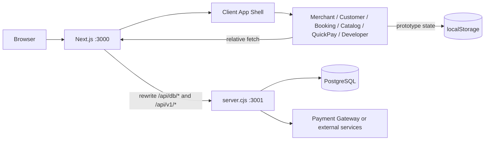

# ChatPOS Developer Guide

คู่มือนี้อธิบายว่า ChatPOS ทำอะไรได้บ้าง ระบบแบ่งส่วนอย่างไร และนักพัฒนาควรแก้หรือเพิ่มฟีเจอร์ตรงไหน เหมาะสำหรับทีมที่ทำงานกับ frontend, API, PostgreSQL และ workflow Merchant KYC

> สถานะปัจจุบัน: ChatPOS ใช้ Next.js เป็น frontend framework แต่ยังมี custom API server แยกจาก Next.js และบาง workflow ใช้ `localStorage` หรือ mock data สำหรับ prototype จึงไม่ควรตีความว่าทุกฟีเจอร์เป็นระบบ production ที่มี persistence และ security ครบแล้ว

## ภาพรวมความสามารถ

ChatPOS รวมความสามารถของระบบจัดการร้านค้าและการชำระเงินไว้ในชุดเดียว:

- สมัครและเข้าสู่ระบบสำหรับ Merchant, Agent, PD และ Admin ตามข้อมูลในฐานข้อมูล
- ลงทะเบียนร้านค้าแบบรวดเร็ว และกรอกข้อมูลธุรกิจ/เอกสาร KYC แบบ wizard
- Merchant back office สำหรับข้อมูลร้านค้า สินค้า บริการ การจอง หน้าขาย และช่องทางรับเงิน
- หน้าสั่งซื้อสำหรับลูกค้าในร้าน โต๊ะอาหาร delivery และ takeaway
- QuickPay/Cashier พร้อมสร้าง PromptPay QR และตรวจสอบสถานะธุรกรรม
- Developer Console สำหรับทดลอง API และดู webhook/developer logs
- Dashboard data จาก PostgreSQL เช่น ร้านค้า Agent, PD, KYC, ธุรกรรม สินค้า และค่าคอมมิชชัน
- โครงสร้างข้อมูลสำหรับเชื่อม Merchant, Agent, PD และสถานะ KYC

## สถาปัตยกรรม



### Frontend

- `src/app/layout.tsx` เป็น root layout ของ Next.js และโหลด global CSS ทั้งหมด
- `src/app/[[...slug]]/page.tsx` เป็น optional catch-all route จึงรับ URL เดิมได้หลายรูปแบบ
- `src/app/[[...slug]]/ClientApp.tsx` โหลด application shell แบบ client-only
- `src/App.tsx` อ่าน `window.location.pathname` แล้วเลือก view ที่เหมาะสม
- View แต่ละชุดอยู่ใน `src/*View.tsx` และ CSS อยู่ในไฟล์ `.css` คู่กัน
- `localStorage` ใช้เก็บ state บางส่วนของร้านค้า การจอง สินค้า หน้าขาย และ session ฝั่ง prototype

เหตุผลที่ใช้ client-only shell คือโค้ดเดิมอ่าน `window`, `document` และ `localStorage` ระหว่าง render/effect หากนำไป SSR โดยตรงจะเกิดปัญหา `window is not defined` หรือ hydration mismatch

### API server

`server.cjs` เป็น Node HTTP server แยกจาก Next.js ทำหน้าที่:

1. รับ request ที่ `/api/db/*` และ `/api/v1/*`
2. ตรวจ method และ route แบบ explicit
3. อ่าน body JSON และ query PostgreSQL ผ่าน `pg.Pool`
4. ตรวจ password ด้วย `bcryptjs` ใน login
5. สร้าง PromptPay EMV payload และ QR data สำหรับ payment flow
6. ส่ง JSON response กลับไปยัง browser

Next.js ไม่ได้ใช้ Route Handlers หรือ Server Actions สำหรับ API ในตอนนี้ แต่ใช้ rewrites ใน [`next.config.ts`](../next.config.ts) เพื่อส่ง request ไปยัง API process

### Database

การเชื่อมต่อใช้ PostgreSQL โดยตั้งค่าผ่าน environment variables:

- `DATABASE_URL` หากต้องการใช้ connection string
- หรือ `PGHOST`, `PGPORT`, `PGUSER`, `PGPASSWORD`, `PGDATABASE`
- `API_PORT` สำหรับพอร์ตของ custom API server ค่าเริ่มต้นคือ `3001`

อย่าใส่ password, token, PII หรือข้อมูลเอกสารจริงลงใน source control หรือ mock data

## การรันระบบ

### ข้อกำหนด

- Node.js 22 หรือรุ่นที่รองรับ Next.js ใน `package.json`
- npm
- PostgreSQL ที่เข้าถึงได้จากเครื่องหรือ container
- ไฟล์ `.env` ที่ตั้งค่าฐานข้อมูลและค่า integration ที่ต้องใช้

### ติดตั้งและพัฒนา

```bash
npm install
npm run dev
```

คำสั่ง `npm run dev` ใช้ `concurrently` เปิดสอง process พร้อมกัน:

- Next.js ที่ `http://localhost:3000`
- API server ที่ `http://localhost:3001`

เมื่อต้องการรัน API อย่างเดียว:

```bash
npm run server
```

### Production

```bash
npm run build
npm run start
```

Dockerfile จะ build Next.js แล้วรันทั้ง Next.js และ API server ใน container เดียว โดยเปิดพอร์ต `3000` และ `3001` ควร route traffic ภายนอกไปที่พอร์ต `3000`

### ตรวจสอบโค้ด

```bash
npm run lint
```

`npm run build` ใช้ตรวจ production compilation และควรรันก่อน deploy หรือเมื่อแก้ routing/config ของ Next.js

## Environment variables

ค่าที่ใช้โดยโค้ดปัจจุบันมีดังนี้:

| Variable | ใช้โดย | ค่าเริ่มต้น/หมายเหตุ |
|---|---|---|
| `DATABASE_URL` | `server.cjs` | ใช้แทนชุด `PG*` ได้ |
| `PGHOST` | `server.cjs` | `127.0.0.1` หากไม่กำหนด |
| `PGPORT` | `server.cjs` | `5432` หากไม่กำหนด |
| `PGUSER` | `server.cjs` | `postgres` หากไม่กำหนด |
| `PGPASSWORD` | `server.cjs` | ว่างหากไม่กำหนด |
| `PGDATABASE` | `server.cjs` | `chatpos` หากไม่กำหนด |
| `API_PORT` | `server.cjs` | `3001` |
| `CHATPOS_API_URL` | `next.config.ts` | `http://127.0.0.1:3001` สำหรับ local API |
| `NEXT_PUBLIC_APP_URL` | application/deployment config | URL ภายนอกของเว็บ |
| `SESSION_SECRET` | security configuration | ต้องเปลี่ยนเป็น secret จริงใน production |

`.env.example` ยังมีตัวแปรชื่อ `VITE_API_URL` และ `VITE_APP_ENV` จากยุค Vite เดิม ซึ่งไม่ใช่ตัวแปรที่ Next routing ชุดปัจจุบันอ่านโดยตรง ให้ใช้ `CHATPOS_API_URL` และ `NEXT_PUBLIC_APP_URL` เป็นหลัก

## Frontend routes

ทุก URL เข้ามาที่ catch-all route แล้ว `src/App.tsx` เป็นผู้เลือก view ตาม pathname:

| URL pattern | View | หน้าที่ |
|---|---|---|
| `/`, `/login`, `/landing` | `LandingPageView` | landing และ login |
| `/merchant`, `/merchant/*` | `MerchantView` | merchant back office |
| `/merchant/register`, `/register` | `MerchantRegistrationView` | สมัครร้านค้าและ KYC wizard |
| `/booking`, `/book`, `/services`, `/appointment` | `BookingPageView` | หน้าจองบริการ |
| `/catalog*`, `/sales*`, `/page/*`, `/sp/*` | `CatalogPageView` | catalog และ sales page |
| `/customer`, `/order`, `/delivery`, `/takeaway`, `/c/*`, `/t*` | `CustomerView` | สั่งซื้อและโต๊ะอาหาร |
| `/shop`, `/quickpay`, `/pay`, `/kiosk`, `/display`, `/s/*` | `QuickPayView` | cashier และ payment link |
| `/developer/*` | `DeveloperConsoleView` | API playground สำหรับ user ที่ login แล้ว |

เมื่อเพิ่ม route ใหม่ ให้ตรวจลำดับเงื่อนไขใน `src/App.tsx` ด้วย เพราะ route ที่ใช้ `startsWith()` อาจครอบคลุม pathname อื่นโดยไม่ตั้งใจ

## ความสามารถตาม workflow

### Merchant onboarding และ KYC

ปัจจุบัน frontend รองรับแนวคิดการสมัครเป็นสองช่วง:

1. สมัครเปิดร้านค้าเริ่มต้นแบบรวดเร็ว
2. กรอกข้อมูลธุรกิจและเอกสาร KYC แบบละเอียด

ข้อมูลที่ workflow รองรับในระดับ UI/API ได้แก่ข้อมูลผู้สมัคร ร้านค้า ประเภทธุรกิจ เลขประจำตัว บัญชีธนาคาร เอกสาร และ consent/PDPA ตาม `registrationI18n.ts` และ `MerchantRegistrationView.tsx`

API ที่เกี่ยวข้อง:

- `POST /api/db/auth/register-merchant`
- `GET /api/db/kyc`
- `POST /api/db/kyc/update-status`

ข้อควรเข้าใจ: โค้ดปัจจุบันมีข้อมูล KYC, role Agent/PD และสถานะสำหรับ dashboard/API แล้ว แต่ยังไม่ใช่ implementation เต็มรูปแบบของ Merchant KYC ที่มี agent assignment, chat/post, immutable document versions, multi-level approval และ audit log ครบทุกขั้นตาม production specification หากพัฒนาต่อให้ใช้ skill [`merchant-kyc`](../.github/skills/merchant-kyc/SKILL.md) เป็นข้อกำหนด workflow

กฎ domain ที่ต้องรักษา:

- Agent ตรวจสอบเบื้องต้นและส่งต่อได้ แต่ไม่อนุมัติขั้นสุดท้ายคนเดียว
- เอกสารใหม่ต้องเป็น version ใหม่ ห้ามเขียนทับหลักฐานเดิม
- การขอข้อมูลเพิ่มควรเชื่อมกับ case และเอกสารที่ต้องแก้
- ทุก status transition สำคัญต้องเก็บ actor, เวลา, เหตุผล และ audit event
- ข้อมูลบัตรประชาชนและบัญชีธนาคารต้อง mask เมื่อไม่จำเป็นต้องแสดงเต็ม

### Merchant back office

`MerchantView.tsx` รวมความสามารถหลายกลุ่มไว้ใน dashboard เดียว เช่น:

- ดูสถานะร้านค้าและ KYC
- จัดการสินค้า หมวดหมู่ สต็อก และราคา
- จัดการบริการและตารางจอง
- สร้าง/แก้ sales page และ catalog
- สร้างลิงก์หรือ QR สำหรับช่องทางขาย
- ดูคำสั่งซื้อ รายการชำระเงิน และการจ่ายเงิน
- ตั้งค่าโปรไฟล์และ API credentials บางส่วน

ข้อมูลที่เป็น operational prototype หลายรายการถูกเก็บใน `localStorage` และ sync ระหว่างหน้าด้วย `storage` event จึงควรย้ายไป API/database เมื่อทำระบบหลายผู้ใช้หรือ production

### Customer ordering

`CustomerView.tsx` รองรับการเลือกสินค้า จัดการตะกร้า ส่งคำสั่งซื้อ เรียกพนักงาน และแยก context ของโต๊ะ/ช่องทาง เช่น delivery หรือ takeaway ข้อมูลคำสั่งซื้อบางส่วนใช้ key ใน `localStorage` เช่น `cust_orders_*` และ `merchant_live_orders`

### Booking และ digital catalog

- `BookingPageView.tsx` แสดงบริการ เวลา และสร้างรายการจอง
- `CatalogPageView.tsx` แสดงหน้าขาย/catalog ที่อ้างอิง slug และข้อมูลที่ merchant บันทึกไว้
- `MerchantView.tsx` เป็นจุดจัดการข้อมูลบริการ หน้าขาย และ QR/link

### Payment และ Developer Console

`QuickPayView.tsx` และ `chatposApi.ts` ใช้ API สำหรับ:

- สร้าง PromptPay QR
- ตรวจสถานะ payment reference
- ยืนยันธุรกรรม
- ดู balance
- สร้าง payout

`DeveloperConsoleView.tsx` เป็นเครื่องมือทดลอง endpoint และดู developer logs สำหรับผู้ใช้ที่ผ่าน login ใน client state แล้ว ไม่ควรถือว่าเป็น authorization boundary สำหรับ production API เพราะการป้องกัน route ปัจจุบันเกิดใน frontend

## API reference ภายใน

### Database API: `/api/db`

| Method | Endpoint | หน้าที่ |
|---|---|---|
| `POST` | `/auth/login` | login และดึงข้อมูล role ที่เกี่ยวข้อง |
| `POST` | `/auth/register-merchant` | สมัคร Merchant |
| `POST` | `/auth/register-agent` | สมัคร Agent |
| `POST` | `/auth/register-pd` | สมัคร PD |
| `GET` | `/health` | ตรวจการเชื่อมต่อฐานข้อมูล |
| `GET` | `/stats` | ดึงสถิติภาพรวม |
| `GET` | `/kyc` | ดึง KYC cases |
| `POST` | `/kyc/update-status` | เปลี่ยนสถานะ KYC |
| `GET` | `/stores` | ดึงร้านค้า |
| `GET` | `/agents` | ดึง Agent |
| `GET` | `/pds` | ดึง PD |
| `GET` | `/transactions` | ดึงธุรกรรม |
| `POST` | `/transactions/create` | สร้างธุรกรรม |
| `GET` | `/products` | ดึงสินค้า |
| `GET` | `/commissions` | ดึงค่าคอมมิชชัน |

### Developer API: `/api/v1`

| Method | Endpoint | หน้าที่ |
|---|---|---|
| `POST` | `/payments/qr` | สร้าง payment QR |
| `GET` | `/payments/:reference` | ตรวจสถานะธุรกรรม |
| `POST` | `/payments/confirm` | ยืนยัน payment |
| `GET` | `/balance` | ดู balance และจำนวนธุรกรรม |
| `POST` | `/auth` | สร้าง API token สำหรับ playground |
| `POST` | `/payouts` | สร้าง payout |
| `GET` | `/developer/logs` | ดู webhook event logs |

ตัวอย่างการเรียกจาก frontend ควรใช้ relative endpoint เช่น:

```ts
await fetch('/api/db/health')
await fetch('/api/v1/balance')
```

อย่า hardcode database URL หรือ secret ใน component และอย่าใช้ `NEXT_PUBLIC_*` กับค่าที่เป็นความลับ

## Data access และ state

### PostgreSQL state

ใช้ `src/dbApi.ts` เป็น helper สำหรับ `/api/db` และแปลงข้อมูลบางส่วนจาก database ให้เข้ากับ model ใน `mockData.ts` เพื่อให้ view เดิมใช้งานได้

ใช้ `src/chatposApi.ts` เป็น helper สำหรับ Developer API มีความสามารถอ่าน API key จาก localStorage และแนบ `Authorization: Bearer ...` ให้ request

### Browser prototype state

ข้อมูลที่พบว่าเก็บใน browser ได้แก่:

- merchant login/session บางส่วน
- active tab และ hash ของ dashboard
- สินค้า หมวดหมู่ บริการ และการจอง
- sales pages, QR slugs และ channel groups
- customer orders, staff calls และ live merchant orders
- pending checkout และ recent transactions

เมื่อเพิ่ม state ใหม่ให้ระบุให้ชัดว่าเป็น `server state`, `client state` หรือ `mock state` และกำหนด migration path หากจะรองรับหลายอุปกรณ์

## แนวทางพัฒนาต่อ

1. แยก route selection ออกจาก `src/App.tsx` ไปเป็น Next route segments ทีละ workflow เมื่อจำเป็นต้องใช้ SSR, metadata หรือ server authorization
2. ย้าย API จาก custom `server.cjs` ไป Next Route Handlers หรือ service backend ที่มี validation และ error contract ชัดเจน หากต้องการรวม deployment
3. เพิ่ม schema validation ของ request/response ก่อนส่ง query database
4. เพิ่ม authentication/session ฝั่ง server แทนการพึ่ง localStorage เพียงอย่างเดียว
5. แยก authorization ของ Merchant, Agent, PD, Compliance และ Admin ที่ API ไม่ใช่เฉพาะหน้า frontend
6. ย้ายข้อมูลธุรกิจและ order state ที่ต้องใช้ข้ามอุปกรณ์จาก localStorage ไป PostgreSQL
7. ทำ KYC case, document version, KYC chat และ audit log ให้เป็น append-only model
8. เพิ่ม tests สำหรับ status transition, permission matrix, payment idempotency และ document access
9. เพิ่ม rate limiting, CORS policy ที่จำกัด origin, upload validation, encryption และ secret rotation ก่อน production

## Checklist งานที่ต้องทำต่อ

Checklist แบบแบ่ง phase, owner และ Definition of Done แยกไว้ที่ [docs/NEXT_STEPS_CHECKLIST.md](NEXT_STEPS_CHECKLIST.md) เพื่อให้ใช้ร่วมกับ Integration Guide และติดตามสถานะจากไฟล์เดียว

## วิธีแก้ไฟล์อย่างปลอดภัย

- เริ่มจาก component หรือ API route ที่เป็นเจ้าของ behavior จริง
- ตรวจ actor, state transition และ data persistence ก่อนเพิ่มปุ่มหรือ field
- ถ้าแก้ client component ที่ใช้ browser API ให้คงไว้ใน client boundary
- ถ้าเพิ่ม global CSS ให้ import ผ่าน `src/app/layout.tsx` ตามกติกา Next.js
- ใช้ icon จาก `lucide-react` ตาม pattern เดิม
- อย่าลบข้อมูลเก่าหรือ document version ในชื่อการแก้ไขข้อมูล
- ทำ mock data ให้ปราศจาก PII จริง
- ตรวจด้วย `npm run lint` และ `npm run build` เมื่อเหมาะสมกับขอบเขตการเปลี่ยนแปลง
