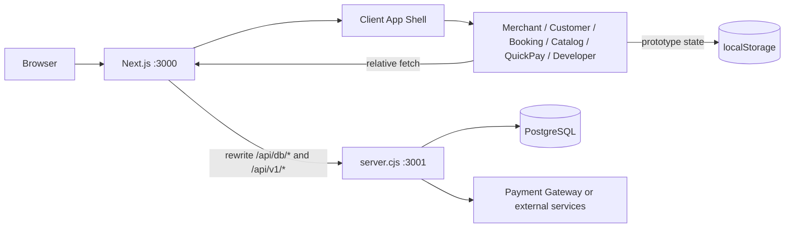
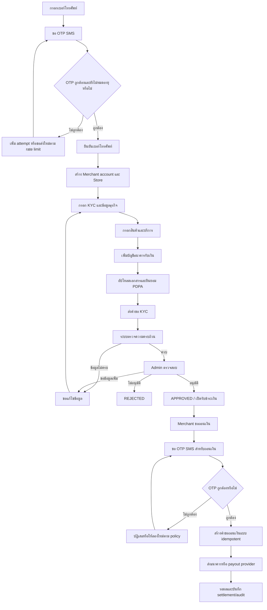

# ChatPOS Developer Guide

คู่มือนี้อธิบายว่า ChatPOS ทำอะไรได้บ้าง ระบบแบ่งส่วนอย่างไร และนักพัฒนาควรแก้หรือเพิ่มฟีเจอร์ตรงไหน เหมาะสำหรับทีมที่ทำงานกับ frontend, API, PostgreSQL และ workflow Merchant KYC

> สถานะปัจจุบัน: ChatPOS ใช้ Next.js เป็น frontend framework แต่ยังมี custom API server แยกจาก Next.js และบาง workflow ใช้ `localStorage` หรือ mock data สำหรับ prototype จึงไม่ควรตีความว่าทุกฟีเจอร์เป็นระบบ production ที่มี persistence และ security ครบแล้ว

## ภาพรวมความสามารถ

ChatPOS รวมความสามารถของระบบจัดการร้านค้าและการชำระเงินไว้ในชุดเดียว:

- สมัครและเข้าสู่ระบบสำหรับ Merchant, Agent, PD และ Admin ตามข้อมูลในฐานข้อมูล
- ลงทะเบียนร้านค้าแบบรวดเร็ว และกรอกข้อมูลธุรกิจ/เอกสาร KYC แบบ wizard
- Merchant back office สำหรับข้อมูลร้านค้า สินค้า บริการ การจอง หน้าขาย และช่องทางรับเงิน
- หน้าสั่งซื้อสำหรับลูกค้าในร้าน โต๊ะอาหาร delivery และ takeaway
- QuickPay/Cashier พร้อมสร้าง PromptPay QR และตรวจสอบสถานะธุรกรรม
- Developer Console สำหรับทดลอง API และดู webhook/developer logs
- Dashboard data จาก PostgreSQL เช่น ร้านค้า Agent, PD, KYC, ธุรกรรม สินค้า และค่าคอมมิชชัน
- โครงสร้างข้อมูลสำหรับเชื่อม Merchant, Agent, PD และสถานะ KYC

## สถาปัตยกรรม



### Frontend

- `src/app/layout.tsx` เป็น root layout ของ Next.js และโหลด global CSS ทั้งหมด
- `src/app/[[...slug]]/page.tsx` เป็น optional catch-all route จึงรับ URL เดิมได้หลายรูปแบบ
- `src/app/[[...slug]]/ClientApp.tsx` โหลด application shell แบบ client-only
- `src/App.tsx` อ่าน `window.location.pathname` แล้วเลือก view ที่เหมาะสม
- View แต่ละชุดอยู่ใน `src/*View.tsx` และ CSS อยู่ในไฟล์ `.css` คู่กัน
- `localStorage` ใช้เก็บ state บางส่วนของร้านค้า การจอง สินค้า หน้าขาย และ session ฝั่ง prototype

เหตุผลที่ใช้ client-only shell คือโค้ดเดิมอ่าน `window`, `document` และ `localStorage` ระหว่าง render/effect หากนำไป SSR โดยตรงจะเกิดปัญหา `window is not defined` หรือ hydration mismatch

### API server

`server.cjs` เป็น Node HTTP server แยกจาก Next.js ทำหน้าที่:

1. รับ request ที่ `/api/db/*` และ `/api/v1/*`
2. ตรวจ method และ route แบบ explicit
3. อ่าน body JSON และ query PostgreSQL ผ่าน `pg.Pool`
4. ตรวจ password ด้วย `bcryptjs` ใน login
5. สร้าง PromptPay EMV payload และ QR data สำหรับ payment flow
6. ส่ง JSON response กลับไปยัง browser

Next.js ไม่ได้ใช้ Route Handlers หรือ Server Actions สำหรับ API ในตอนนี้ แต่ใช้ rewrites ใน [`next.config.ts`](../next.config.ts) เพื่อส่ง request ไปยัง API process

### Database

การเชื่อมต่อใช้ PostgreSQL โดยตั้งค่าผ่าน environment variables:

- `DATABASE_URL` หากต้องการใช้ connection string
- หรือ `PGHOST`, `PGPORT`, `PGUSER`, `PGPASSWORD`, `PGDATABASE`
- `API_PORT` สำหรับพอร์ตของ custom API server ค่าเริ่มต้นคือ `3001`

อย่าใส่ password, token, PII หรือข้อมูลเอกสารจริงลงใน source control หรือ mock data

## การรันระบบ

### ข้อกำหนด

- Node.js 22 หรือรุ่นที่รองรับ Next.js ใน `package.json`
- npm
- PostgreSQL ที่เข้าถึงได้จากเครื่องหรือ container
- ไฟล์ `.env` ที่ตั้งค่าฐานข้อมูลและค่า integration ที่ต้องใช้

### ติดตั้งและพัฒนา

```bash
npm install
npm run dev
```

คำสั่ง `npm run dev` ใช้ `concurrently` เปิดสอง process พร้อมกัน:

- Next.js ที่ `http://localhost:3000`
- API server ที่ `http://localhost:3001`

เมื่อต้องการรัน API อย่างเดียว:

```bash
npm run server
```

เมื่อต้องการสร้างหรืออัปเดต schema ของ PostgreSQL:

```bash
npm run db:migrate
```

Migration แรกอยู่ที่ [`database/migrations/001_initial_chatpos_schema.sql`](../database/migrations/001_initial_chatpos_schema.sql) และครอบคลุมตาราง core ที่ `server.cjs` ใช้ รวมถึง Merchant KYC, assignment, document version, audit, idempotency และ webhook event dedupe ตาราง idempotency/nonce/webhook เป็น durable schema สำหรับการต่อยอด production; client helper แบบ in-memory ยังใช้เฉพาะ unit test และไม่ควรใช้แทน persistence layer จริง

### Production

```bash
npm run build
npm run start
```

Dockerfile จะ build Next.js แล้วรันทั้ง Next.js และ API server ใน container เดียว โดยเปิดพอร์ต `3000` และ `3001` ควร route traffic ภายนอกไปที่พอร์ต `3000`

### ตรวจสอบโค้ด

```bash
npm run lint
```

`npm run build` ใช้ตรวจ production compilation และควรรันก่อน deploy หรือเมื่อแก้ routing/config ของ Next.js

## Environment variables

ค่าที่ใช้โดยโค้ดปัจจุบันมีดังนี้:

| Variable | ใช้โดย | ค่าเริ่มต้น/หมายเหตุ |
|---|---|---|
| `DATABASE_URL` | `server.cjs` | ใช้แทนชุด `PG*` ได้ |
| `PGHOST` | `server.cjs` | `127.0.0.1` หากไม่กำหนด |
| `PGPORT` | `server.cjs` | `5432` หากไม่กำหนด |
| `PGUSER` | `server.cjs` | `postgres` หากไม่กำหนด |
| `PGPASSWORD` | `server.cjs` | ว่างหากไม่กำหนด |
| `PGDATABASE` | `server.cjs` | `chatpos` หากไม่กำหนด |
| `API_PORT` | `server.cjs` | `3001` |
| `CHATPOS_API_URL` | `next.config.ts` | `http://127.0.0.1:3001` สำหรับ local API |
| `NEXT_PUBLIC_APP_URL` | application/deployment config | URL ภายนอกของเว็บ |
| `SESSION_SECRET` | security configuration | ต้องเปลี่ยนเป็น secret จริงใน production |

`.env.example` ยังมีตัวแปรชื่อ `VITE_API_URL` และ `VITE_APP_ENV` จากยุค Vite เดิม ซึ่งไม่ใช่ตัวแปรที่ Next routing ชุดปัจจุบันอ่านโดยตรง ให้ใช้ `CHATPOS_API_URL` และ `NEXT_PUBLIC_APP_URL` เป็นหลัก

## Frontend routes

ทุก URL เข้ามาที่ catch-all route แล้ว `src/App.tsx` เป็นผู้เลือก view ตาม pathname:

| URL pattern | View | หน้าที่ |
|---|---|---|
| `/`, `/login`, `/landing` | `LandingPageView` | landing และ login |
| `/merchant`, `/merchant/*` | `MerchantView` | merchant back office |
| `/merchant/register`, `/register` | `MerchantRegistrationView` | สมัครร้านค้าและ KYC wizard |
| `/booking`, `/book`, `/services`, `/appointment` | `BookingPageView` | หน้าจองบริการ |
| `/catalog*`, `/sales*`, `/page/*`, `/sp/*` | `CatalogPageView` | catalog และ sales page |
| `/customer`, `/order`, `/delivery`, `/takeaway`, `/c/*`, `/t*` | `CustomerView` | สั่งซื้อและโต๊ะอาหาร |
| `/shop`, `/quickpay`, `/pay`, `/kiosk`, `/display`, `/s/*` | `QuickPayView` | cashier และ payment link |
| `/developer/*` | `DeveloperConsoleView` | API playground สำหรับ user ที่ login แล้ว |

เมื่อเพิ่ม route ใหม่ ให้ตรวจลำดับเงื่อนไขใน `src/App.tsx` ด้วย เพราะ route ที่ใช้ `startsWith()` อาจครอบคลุม pathname อื่นโดยไม่ตั้งใจ

## ความสามารถตาม workflow

### Merchant onboarding และ KYC

ปัจจุบัน frontend รองรับแนวคิดการสมัครเป็นสองช่วง:

1. สมัครเปิดร้านค้าเริ่มต้นแบบรวดเร็ว
2. กรอกข้อมูลธุรกิจและเอกสาร KYC แบบละเอียด

ข้อมูลที่ workflow รองรับในระดับ UI/API ได้แก่ข้อมูลผู้สมัคร ร้านค้า ประเภทธุรกิจ เลขประจำตัว บัญชีธนาคาร เอกสาร และ consent/PDPA ตาม `registrationI18n.ts` และ `MerchantRegistrationView.tsx`

API ที่เกี่ยวข้อง:

- `POST /api/db/auth/register-merchant`
- `POST /api/v1/assignments/requests` สำหรับส่งคำขอผูก Agent ผ่าน signed server-side client
- `POST /api/webhooks/assignment-status` สำหรับรับ signed status callback จาก Backoffice
- `GET /api/db/assignments` สำหรับอ่านสถานะ assignment ของ Store
- `GET /api/db/kyc`
- `POST /api/db/kyc/update-status`

Phase 2 มี assignment service ใน `server/integration/assignmentService.cjs` ซึ่งบันทึก request และ event history แบบ durable, ใช้ idempotency ตาม `storeId + sourceRequestId`, ตรวจ callback ด้วย raw body และ HMAC แบบ constant-time และเปลี่ยน `Store.currentAgentId`/`Store.currentPdId` เฉพาะ callback สถานะ `ACCEPTED` ที่ resolve Agent และ PD ที่ active ได้เท่านั้น สถานะ `REJECTED`, `EXPIRED` และ `REASSIGNED` จะไม่ทำให้ Store ถูกผูก Agent ต่อ ส่วน callback ซ้ำหรือ callback ที่มาช้ากว่าจะถูก dedupe/ignore ใน transaction เดียวกับ state update

Merchant portal แสดงสถานะ `PENDING_ADMIN_ASSIGNMENT`, `PENDING_AGENT_ACCEPTANCE`, `ACCEPTED`, `REJECTED`, `EXPIRED` และ `REASSIGNED` พร้อม next action และจะแสดง Agent/PD เฉพาะเมื่อ status เป็น `ACCEPTED` การสมัคร Merchant จะส่ง assignment request หลังสร้าง Store สำเร็จ โดยรองรับทั้งการระบุเบอร์ Agent และการเว้นว่างให้ Admin จัดสรร หาก `AGENT_PD_INTEGRATION_ENABLED` หรือ `AGENT_PD_ASSIGNMENT_ENABLED` ยังปิดอยู่ การสมัครบัญชียังสำเร็จแต่จะไม่ forward assignment ไป Backoffice

ข้อจำกัดของ Phase 2: route ปัจจุบันยังใช้ `X-Store-Id`/`AGENT_PD_STORE_ID` เป็น store context เพราะ authentication/session ของ custom API server ยังเป็น prototype ต้องย้ายไป server-side session หรือ verified Store-scoped credential ก่อน production และต้องทดสอบ command/callback กับ Backoffice staging จริง รวมถึง receiver downtime และ retry recovery

ข้อควรเข้าใจ: โค้ดปัจจุบันมีข้อมูล KYC, role Agent/PD และสถานะสำหรับ dashboard/API แล้ว แต่ยังไม่ใช่ implementation เต็มรูปแบบของ Merchant KYC ที่มี agent assignment, chat/post, immutable document versions, multi-level approval และ audit log ครบทุกขั้นตาม production specification หากพัฒนาต่อให้ใช้ skill [`merchant-kyc`](../.github/skills/merchant-kyc/SKILL.md) เป็นข้อกำหนด workflow

กฎ domain ที่ต้องรักษา:

- Agent ตรวจสอบเบื้องต้นและส่งต่อได้ แต่ไม่อนุมัติขั้นสุดท้ายคนเดียว
- เอกสารใหม่ต้องเป็น version ใหม่ ห้ามเขียนทับหลักฐานเดิม
- การขอข้อมูลเพิ่มควรเชื่อมกับ case และเอกสารที่ต้องแก้
- ทุก status transition สำคัญต้องเก็บ actor, เวลา, เหตุผล และ audit event
- ข้อมูลบัตรประชาชนและบัญชีธนาคารต้อง mask เมื่อไม่จำเป็นต้องแสดงเต็ม

### Flow สมัคร Merchant ตั้งแต่ OTP ถึงเปิดใช้งาน

Flow นี้เป็นลำดับมาตรฐานสำหรับ Merchant registration, KYC, ข้อมูลร้านค้า, สินค้า/บริการ, บัญชีรับเงิน และการอนุมัติ โดยแยกส่วนที่มีอยู่ใน prototype ปัจจุบันออกจากส่วนที่ต้องทำต่อเป็น production workflow



#### 1. สมัครและยืนยันเบอร์ด้วย OTP SMS

1. Merchant กรอกเบอร์โทรศัพท์และระบบ normalize เป็นรูปแบบมาตรฐานก่อนตรวจซ้ำ
2. ระบบสร้าง OTP ตาม `purpose` เช่น `merchant_registration`, `change_phone` หรือ `withdrawal` และผูกกับเบอร์, session/request ID และวันหมดอายุ
3. ระบบเก็บเฉพาะ hash ของ OTP ไม่เก็บรหัสจริงใน database หรือ log แล้วส่งรหัสผ่าน SMS provider
4. จำกัดการขอส่งใหม่และจำนวนครั้งที่กรอกผิด เช่น cooldown ต่อเบอร์/IP/device และ lock ชั่วคราวเมื่อเกินจำนวนครั้ง
5. เมื่อกรอกรหัสถูกต้อง ระบบต้องตรวจ `purpose`, expiry, attempt, nonce และสถานะ `used` ก่อน mark เป็นใช้แล้วเพียงครั้งเดียว
6. หลังยืนยันสำเร็จให้บันทึก `phoneVerifiedAt` และออก registration session/server-side token ห้ามถือว่าแค่ส่ง OTP สำเร็จคือยืนยันตัวตนแล้ว
7. การส่ง OTP ซ้ำต้อง invalidate OTP เดิมตาม policy และห้ามส่งรหัสผ่าน query string, browser storage หรือ log

ค่า provider ปัจจุบันอยู่ใน `.env.example` เช่น `SMS_OTP_ENABLED`, `SMS_BASE_URL`, `SMS_BEARER_TOKEN`, `SMS_CALLBACK_SECRET` และ `SMS_REQUEST_TIMEOUT_MS` แต่ค่าเริ่มต้นยังปิดอยู่ (`false`) และ repository ยังไม่มี endpoint OTP production ที่ใช้จริง จึงต้องเพิ่ม OTP service, persistence, rate limiting และ provider adapter ก่อนเปิดใช้งาน

#### 2. สร้างบัญชี Merchant และข้อมูลร้านค้า

หลังยืนยัน OTP สำเร็จ Merchant กรอก email, password, ชื่อผู้สมัคร, ชื่อร้าน, ประเภทร้าน, เบอร์ที่ยืนยันแล้ว และข้อมูลติดต่อ ระบบควรทำใน transaction เดียว:

- สร้าง `User` ด้วย role `owner` หรือ `merchant`
- สร้าง `Store` และผูกกับ `User`
- สร้าง `MerchantIdentity` สำหรับ merchant ID ที่ระบบออกให้
- สร้าง `KycVerification` หรือ `merchant_kyc_cases` สถานะเริ่มต้น `draft`
- บันทึก consent version และ audit event ของการสมัคร

API prototype ปัจจุบันคือ `POST /api/db/auth/register-merchant` และบันทึก `User`, `Store`, `MerchantIdentity` และ `KycVerification` แต่ยังไม่ได้บังคับ OTP ก่อนสร้างบัญชีอย่างสมบูรณ์ ควรเพิ่ม transaction rollback, email/phone uniqueness และ server-side authorization ก่อนใช้ production

#### 3. กรอก KYC และข้อมูลธุรกิจ

Merchant เลือกประเภทกิจการและกรอกข้อมูลตามลำดับ ไม่ควรใช้ form เดียวที่ไม่มี business rule:

1. ข้อมูลเจ้าของกิจการหรือข้อมูลนิติบุคคล
2. ชื่อร้าน ประเภทธุรกิจ ที่อยู่ สาขา พิกัด และช่องทางการขาย
3. สินค้า/บริการหลัก รูปแบบการดำเนินงาน ยอดขายโดยประมาณ และวัตถุประสงค์การรับเงิน
4. ข้อมูลบัญชีธนาคารรับเงิน
5. เอกสาร KYC ที่ตรงกับประเภทกิจการ
6. ตรวจทานข้อมูล, consent/PDPA และ submit

เลขบัตรประชาชน, เลขทะเบียนนิติบุคคล, เลขบัญชี และเอกสารต้อง mask เมื่อแสดงผล ใช้ private storage สำหรับไฟล์ และสร้าง document version ใหม่ทุกครั้งที่ส่งแก้ไข ห้าม overwrite version เดิม

สถานะที่ควรใช้:

`draft` -> `ready_for_submission` -> `pending_admin_review` -> `needs_more_info` -> `approved` หรือ `rejected`

หากใช้ Agent/PD workflow ร่วมด้วย ให้ Agent ตรวจสอบเบื้องต้นและส่งต่อ ส่วน PD/Compliance หรือผู้มีอำนาจเป็นผู้อนุมัติขั้นสุดท้าย ไม่ให้ Agent กดอนุมัติแทน

#### 4. ลงข้อมูลร้านค้า สินค้า และบริการ

ข้อมูลร้านค้าเป็น profile ของ Store ส่วนสินค้าและบริการเป็นข้อมูลที่ Merchant ใช้เปิดขายจริง ควรแยกสถานะและ audit ออกจาก KYC:

- ร้านค้า: ชื่อร้าน, ที่อยู่, เบอร์, ประเภทร้าน, เวลาเปิด-ปิด, ช่องทางขาย และสถานะเปิดใช้งาน
- สินค้า: ชื่อ, SKU, หมวดหมู่, รายละเอียด, ราคาขาย, ต้นทุน, stock, รูปภาพ และสถานะ active
- บริการ: ชื่อบริการ, รายละเอียด, ราคา, ระยะเวลา, จำนวนคิว/slot, เงื่อนไขการจอง และสถานะ active

ตาราง `Product` มีอยู่ใน migration และถูกใช้โดย `/api/db/products` แล้ว ส่วนข้อมูลบริการและตารางเวลาปัจจุบันยังมีส่วนที่อยู่ใน prototype/localStorage จึงควรเพิ่มตาราง service/availability เมื่อจะรองรับหลายอุปกรณ์หรือ production

กติกาการบันทึก:

- Merchant แก้ไขเฉพาะ Store ของตนเอง
- การเปลี่ยนข้อมูลที่กระทบ KYC ต้องสร้าง profile version ใหม่และส่ง review ตาม policy
- การแก้สินค้า/บริการไม่ควรแก้ทับประวัติราคา/สถานะที่จำเป็นต่อการตรวจสอบ transaction
- ห้ามเปิดขายสินค้า/บริการก่อน Store ผ่านสถานะที่ policy อนุญาต

#### 5. ลงข้อมูลบัญชีธนาคารสำหรับรับเงิน

1. Merchant เลือกธนาคารและกรอกเลขบัญชี, ชื่อบัญชี และประเภทบัญชี
2. ระบบตรวจ format และตรวจว่าชื่อบัญชีสอดคล้องกับเจ้าของกิจการ/นิติบุคคลตาม policy
3. Merchant อัปโหลดหน้าสมุดบัญชีหรือเอกสารยืนยันผ่าน private upload
4. ระบบเก็บ checksum, MIME, size, storage locator และ document version; ไม่เก็บ public URL หรือไฟล์ base64 ใน record
5. สถานะบัญชีควรเป็น `pending_verification`, `verified`, `rejected`, `suspended` หรือ `change_requested`
6. การเปลี่ยนบัญชีหลัง verified ต้องทำเป็นบัญชี/เวอร์ชันใหม่, ส่ง OTP ที่เบอร์ verified และอาจต้อง Admin review ใหม่
7. ห้ามให้ Merchant ถอนเงินไปยังบัญชีที่ยังไม่ verified และห้ามให้ frontend เป็นผู้ตัดสินสถานะเอง

prototype ปัจจุบันเก็บข้อมูลบางส่วนใน `Store.payoutBankName`, `Store.payoutAccountNumber`, `Store.payoutAccountName` และ `KycVerification` แต่ยังควรแยกเป็น `merchant_bank_accounts` และ `merchant_bank_account_versions` เพื่อรองรับหลายบัญชี, verification history, masking, replacement และ audit อย่างถูกต้อง

#### 6. ขั้นตอนการอนุมัติโดย Admin ระบบ

เมื่อ Merchant กด submit ระบบต้องสร้าง submission snapshot และเปลี่ยนสถานะใน transaction เดียว จากนั้น Admin ทำงานตามลำดับ:

1. ตรวจว่า OTP/เบอร์, ข้อมูลบังคับ, consent, เอกสาร และบัญชีรับเงินครบ
2. ตรวจ duplicate Merchant, risk flag, ชื่อบัญชีธนาคาร และความสอดคล้องของเอกสาร
3. เปิดดูข้อมูลเท่าที่ role มีสิทธิ์ และบันทึกทุก access/download ที่เป็นข้อมูลอ่อนไหว
4. เลือก action ได้เฉพาะตามสถานะ: `request_more_info`, `approve`, `reject`, `hold`
5. ทุก action ต้องมี actor, timestamp, reason, before/after และ request/correlation ID
6. ถ้าขอข้อมูลเพิ่ม ให้เปลี่ยนเป็น `needs_more_info` และระบุ field/document ที่ต้องแก้ ไม่ลบ submission เดิม
7. ถ้าอนุมัติ ให้เปลี่ยนเป็น `approved`, เปิด feature ที่ policy อนุญาต และส่ง notification
8. ถ้าปฏิเสธ ให้เก็บเหตุผลที่แสดงแก่ Merchant แยกจาก risk rule ภายใน และห้ามเปลี่ยนเป็น approved ผ่าน frontend โดยตรง

API ปัจจุบันมี `GET /api/db/kyc` และ `POST /api/db/kyc/update-status` สำหรับ dashboard/prototype แต่ยังขาด permission matrix, admin session ฝั่ง server, state transition guard, review checklist และ append-only audit ที่ production ต้องมี

#### 7. ขั้นตอนการขอถอนเงินผ่าน OTP SMS

1. Merchant เปิดหน้ากระเป๋าเงิน ระบบอ่าน available balance และตรวจว่า Store/บัญชีธนาคาร/สถานะ KYC ผ่านเงื่อนไข
2. Merchant ระบุจำนวนเงินและบัญชีปลายทาง ระบบตรวจ minimum/maximum, fee, balance, pending withdrawal และ ownership ของบัญชี
3. Merchant กดขอถอน ระบบสร้าง withdrawal intent ที่ยังไม่ส่ง payout และส่ง OTP ไปยังเบอร์โทรศัพท์ที่ verified เท่านั้น
4. OTP ต้องผูกกับ `withdrawalId`, amount, destination account version และ `purpose=withdrawal`; หากเปลี่ยนยอดหรือบัญชีต้องยกเลิก OTP เดิมและสร้าง intent ใหม่
5. Merchant กรอก OTP ระบบตรวจ hash, expiry, attempts, used state และ lock policy จาก server
6. เมื่อยืนยันสำเร็จ ระบบทำ idempotent command ด้วย `Idempotency-Key` เดิมของ withdrawal intent แล้วส่งไป payout provider/Backoffice
7. เปลี่ยนสถานะเป็น `processing` และส่งผลผ่าน webhook/reconciliation เป็น `completed`, `failed`, `reversed` หรือ `cancelled`
8. บันทึก audit, OTP verification result, provider reference, fee, amount และบัญชีเวอร์ชันที่ใช้ โดย mask เลขบัญชีในทุก log/หน้าจอ

ห้ามสร้าง payout จาก frontend โดยตรง, ห้ามถือว่า response `200` คือเงินเข้าบัญชีแล้ว และห้ามสร้าง withdrawal ใหม่เมื่อ request เดิม timeout ก่อนรู้ผล ให้ตรวจสถานะด้วย `withdrawalId`/idempotency key เดิม

ปัจจุบัน `POST /api/v1/payouts` ใน `server.cjs` เป็น prototype ที่คืนสถานะ `processing` และยังไม่มี OTP SMS, durable withdrawal record, provider integration หรือ settlement reconciliation ดังนั้น flow ถอนเงินจริงยังต้อง implement เพิ่มก่อนเปิด feature

#### สถานะ implementation ของ flow นี้

| ขั้นตอน | สถานะปัจจุบัน | จุดที่ต้องทำต่อก่อน production |
|---|---|---|
| OTP สมัคร/ถอนผ่าน SMS | มี provider config ใน `.env.example` แต่ยังปิดและยังไม่มี service จริง | OTP persistence, hash, expiry, rate limit, SMS adapter, verify endpoint และ audit |
| สร้าง Merchant/Store/KYC | มี `POST /api/db/auth/register-merchant` และ core tables | บังคับ OTP, transaction boundary, validation และ server authorization |
| KYC document/version | มี schema รองรับใน migration แต่ยังไม่มี API flow ครบ | private upload, checksum, immutable version, review queue และ access audit |
| สินค้า | มี `Product` และ `/api/db/products` | ownership, validation, history และ production authorization |
| บริการ | ส่วนใหญ่ยังเป็น prototype/localStorage | service/availability schema และ API persistence |
| บัญชีรับเงิน | มี field ใน `Store`/`KycVerification` | dedicated account/version tables, verification และ change control |
| Admin approval | มี endpoint เปลี่ยน KYC status แบบกว้าง | role-based authorization, transition guard, checklist, decision และ audit |
| ถอนเงิน | มี prototype `/api/v1/payouts` | OTP, withdrawal ledger, idempotency, provider webhook และ reconciliation |

### Merchant back office

`MerchantView.tsx` รวมความสามารถหลายกลุ่มไว้ใน dashboard เดียว เช่น:

- ดูสถานะร้านค้าและ KYC
- จัดการสินค้า หมวดหมู่ สต็อก และราคา
- จัดการบริการและตารางจอง
- สร้าง/แก้ sales page และ catalog
- สร้างลิงก์หรือ QR สำหรับช่องทางขาย
- ดูคำสั่งซื้อ รายการชำระเงิน และการจ่ายเงิน
- ตั้งค่าโปรไฟล์และ API credentials บางส่วน

ข้อมูลที่เป็น operational prototype หลายรายการถูกเก็บใน `localStorage` และ sync ระหว่างหน้าด้วย `storage` event จึงควรย้ายไป API/database เมื่อทำระบบหลายผู้ใช้หรือ production

### Customer ordering

`CustomerView.tsx` รองรับการเลือกสินค้า จัดการตะกร้า ส่งคำสั่งซื้อ เรียกพนักงาน และแยก context ของโต๊ะ/ช่องทาง เช่น delivery หรือ takeaway ข้อมูลคำสั่งซื้อบางส่วนใช้ key ใน `localStorage` เช่น `cust_orders_*` และ `merchant_live_orders`

### Booking และ digital catalog

- `BookingPageView.tsx` แสดงบริการ เวลา และสร้างรายการจอง
- `CatalogPageView.tsx` แสดงหน้าขาย/catalog ที่อ้างอิง slug และข้อมูลที่ merchant บันทึกไว้
- `MerchantView.tsx` เป็นจุดจัดการข้อมูลบริการ หน้าขาย และ QR/link

### Payment และ Developer Console

`QuickPayView.tsx` และ `chatposApi.ts` ใช้ API สำหรับ:

- สร้าง PromptPay QR
- ตรวจสถานะ payment reference
- ยืนยันธุรกรรม
- ดู balance
- สร้าง payout

`DeveloperConsoleView.tsx` เป็นเครื่องมือทดลอง endpoint และดู developer logs สำหรับผู้ใช้ที่ผ่าน login ใน client state แล้ว ไม่ควรถือว่าเป็น authorization boundary สำหรับ production API เพราะการป้องกัน route ปัจจุบันเกิดใน frontend

## API reference ภายใน

### Database API: `/api/db`

| Method | Endpoint | หน้าที่ |
|---|---|---|
| `POST` | `/auth/login` | login และดึงข้อมูล role ที่เกี่ยวข้อง |
| `POST` | `/auth/register-merchant` | สมัคร Merchant |
| `POST` | `/auth/register-agent` | สมัคร Agent |
| `POST` | `/auth/register-pd` | สมัคร PD |
| `GET` | `/health` | ตรวจการเชื่อมต่อฐานข้อมูล |
| `GET` | `/stats` | ดึงสถิติภาพรวม |
| `GET` | `/kyc` | ดึง KYC cases |
| `POST` | `/kyc/update-status` | เปลี่ยนสถานะ KYC |
| `GET` | `/stores` | ดึงร้านค้า |
| `GET` | `/agents` | ดึง Agent |
| `GET` | `/pds` | ดึง PD |
| `GET` | `/transactions` | ดึงธุรกรรม |
| `POST` | `/transactions/create` | สร้างธุรกรรม |
| `GET` | `/products` | ดึงสินค้า |
| `GET` | `/commissions` | ดึงค่าคอมมิชชัน |

### Developer API: `/api/v1`

| Method | Endpoint | หน้าที่ |
|---|---|---|
| `POST` | `/payments/qr` | สร้าง payment QR |
| `GET` | `/payments/:reference` | ตรวจสถานะธุรกรรม |
| `POST` | `/payments/confirm` | ยืนยัน payment |
| `GET` | `/balance` | ดู balance และจำนวนธุรกรรม |
| `POST` | `/auth` | สร้าง API token สำหรับ playground |
| `POST` | `/payouts` | สร้าง payout |
| `GET` | `/developer/logs` | ดู webhook event logs |

ตัวอย่างการเรียกจาก frontend ควรใช้ relative endpoint เช่น:

```ts
await fetch('/api/db/health')
await fetch('/api/v1/balance')
```

### Signed Backoffice Client

การเชื่อมต่อ Agent/PD Backoffice ฝั่ง server ใช้ [server/integration/signedMerchantClient.cjs](../server/integration/signedMerchantClient.cjs) เท่านั้น ห้าม import โมดูลนี้จาก `src/` หรือส่ง secret ไป browser โมดูลนี้ทำงานดังนี้:

- serialize JSON เป็น raw body เพียงครั้งเดียว แล้วใช้ string เดิมสำหรับ HTTP body และ SHA-256 digest ทุก retry
- สร้าง canonical path, timestamp, nonce และ `v1=` HMAC-SHA256 signature ตาม [Client Integration Guide](CHATPOS_CLIENT_INTEGRATION_GUIDE.md)
- สร้าง nonce/timestamp/signature ใหม่ต่อ HTTP retry แต่คง `Idempotency-Key`, `sourceRequestId` ใน body และ `X-Request-Id` เดิม
- retry เฉพาะ network error, timeout, `429` และ `5xx` ด้วย exponential backoff + jitter; ไม่ retry `4xx` อื่นหรือ idempotency conflict
- ส่ง structured log ที่มี request metadata, body digest และ error code โดย redaction จะไม่ปล่อย raw body, secret, PII หรือ signature เต็มค่า

สร้าง client ใน custom API server ด้วย `createBackofficeClient()` และตั้ง `AGENT_PD_INTEGRATION_ENABLED=true` เฉพาะ environment ที่ผ่าน staging contract test แล้ว ค่า env และ feature flags ดูได้จาก `.env.example` ส่วน unit tests อยู่ที่ [server/integration/signedMerchantClient.test.cjs](../server/integration/signedMerchantClient.test.cjs) และเรียกด้วย `npm run test:integration`

อย่า hardcode database URL หรือ secret ใน component และอย่าใช้ `NEXT_PUBLIC_*` กับค่าที่เป็นความลับ

## Data access และ state

### PostgreSQL state

ใช้ `src/dbApi.ts` เป็น helper สำหรับ `/api/db` และแปลงข้อมูลบางส่วนจาก database ให้เข้ากับ model ใน `mockData.ts` เพื่อให้ view เดิมใช้งานได้

ใช้ `src/chatposApi.ts` เป็น helper สำหรับ Developer API มีความสามารถอ่าน API key จาก localStorage และแนบ `Authorization: Bearer ...` ให้ request

### Browser prototype state

ข้อมูลที่พบว่าเก็บใน browser ได้แก่:

- merchant login/session บางส่วน
- active tab และ hash ของ dashboard
- สินค้า หมวดหมู่ บริการ และการจอง
- sales pages, QR slugs และ channel groups
- customer orders, staff calls และ live merchant orders
- pending checkout และ recent transactions

เมื่อเพิ่ม state ใหม่ให้ระบุให้ชัดว่าเป็น `server state`, `client state` หรือ `mock state` และกำหนด migration path หากจะรองรับหลายอุปกรณ์

## แนวทางพัฒนาต่อ

1. แยก route selection ออกจาก `src/App.tsx` ไปเป็น Next route segments ทีละ workflow เมื่อจำเป็นต้องใช้ SSR, metadata หรือ server authorization
2. ย้าย API จาก custom `server.cjs` ไป Next Route Handlers หรือ service backend ที่มี validation และ error contract ชัดเจน หากต้องการรวม deployment
3. เพิ่ม schema validation ของ request/response ก่อนส่ง query database
4. เพิ่ม authentication/session ฝั่ง server แทนการพึ่ง localStorage เพียงอย่างเดียว
5. แยก authorization ของ Merchant, Agent, PD, Compliance และ Admin ที่ API ไม่ใช่เฉพาะหน้า frontend
6. ย้ายข้อมูลธุรกิจและ order state ที่ต้องใช้ข้ามอุปกรณ์จาก localStorage ไป PostgreSQL
7. ทำ KYC case, document version, KYC chat และ audit log ให้เป็น append-only model
8. เพิ่ม tests สำหรับ status transition, permission matrix, payment idempotency และ document access
9. เพิ่ม rate limiting, CORS policy ที่จำกัด origin, upload validation, encryption และ secret rotation ก่อน production

## Checklist งานที่ต้องทำต่อ

Checklist แบบแบ่ง phase, owner และ Definition of Done แยกไว้ที่ [docs/NEXT_STEPS_CHECKLIST.md](NEXT_STEPS_CHECKLIST.md) เพื่อให้ใช้ร่วมกับ Integration Guide และติดตามสถานะจากไฟล์เดียว

## วิธีแก้ไฟล์อย่างปลอดภัย

- เริ่มจาก component หรือ API route ที่เป็นเจ้าของ behavior จริง
- ตรวจ actor, state transition และ data persistence ก่อนเพิ่มปุ่มหรือ field
- ถ้าแก้ client component ที่ใช้ browser API ให้คงไว้ใน client boundary
- ถ้าเพิ่ม global CSS ให้ import ผ่าน `src/app/layout.tsx` ตามกติกา Next.js
- ใช้ icon จาก `lucide-react` ตาม pattern เดิม
- อย่าลบข้อมูลเก่าหรือ document version ในชื่อการแก้ไขข้อมูล
- ทำ mock data ให้ปราศจาก PII จริง
- ตรวจด้วย `npm run lint` และ `npm run build` เมื่อเหมาะสมกับขอบเขตการเปลี่ยนแปลง
