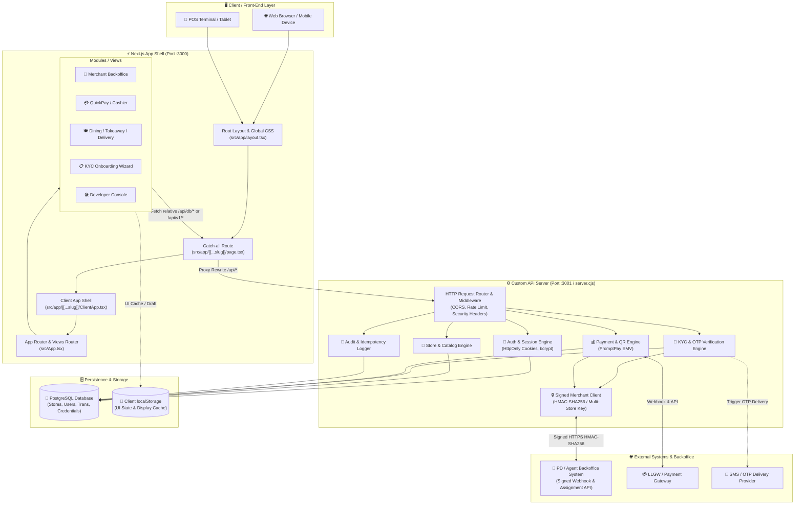
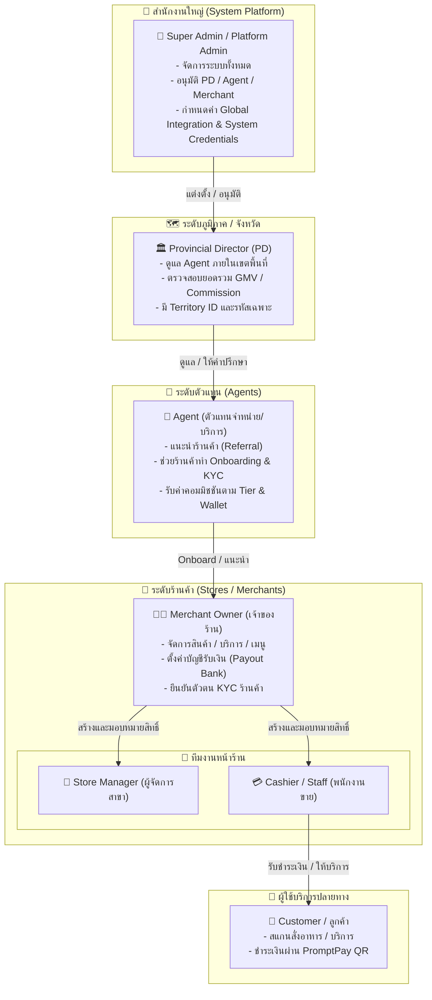
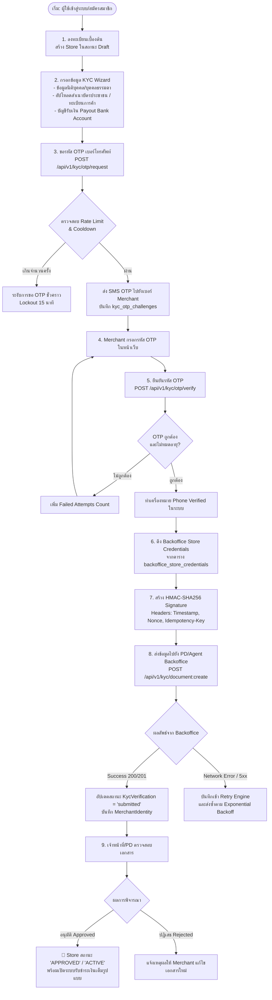
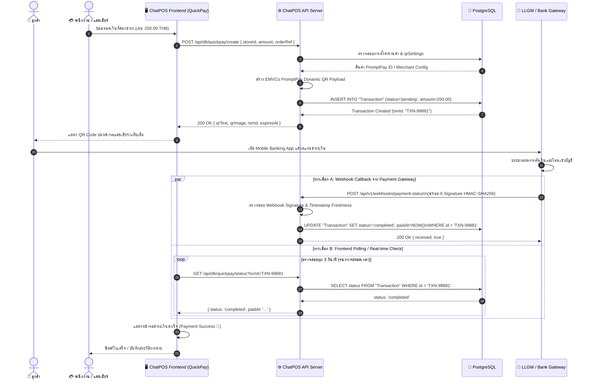
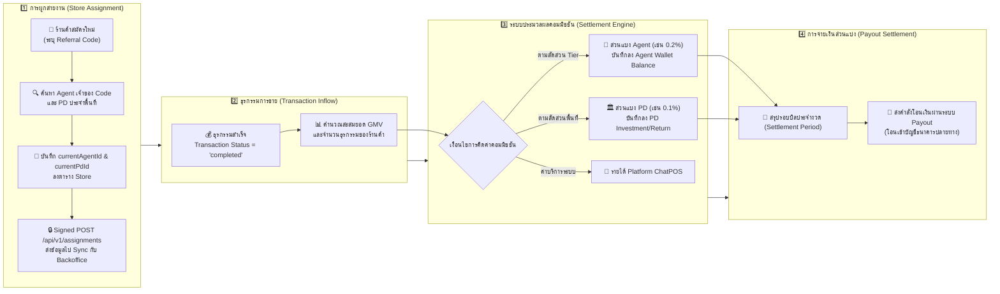
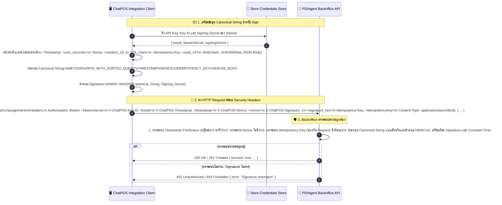
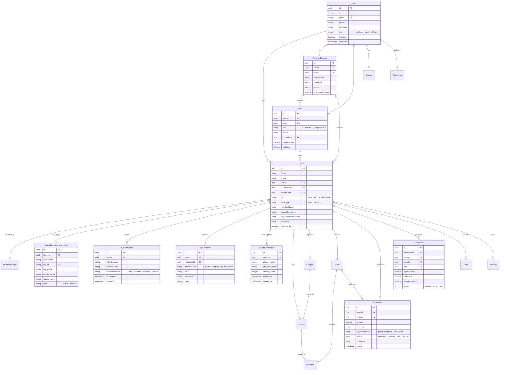

# ChatPOS System Architecture & Flow Diagrams
**เอกสารรวมแผนภาพสถาปัตยกรรมและกระบวนการทำงานของระบบ ChatPOS**

เอกสารนี้รวบรวมแผนภาพ (Mermaid Diagrams & Flowcharts) ที่อธิบายสถาปัตยกรรมระบบ, โครงสร้างบทบาทผู้ใช้งาน, ลำดับการทำงาน (Workflows), กลไกความปลอดภัย และโครงสร้างฐานข้อมูล (ERD) ของระบบ **ChatPOS**

---

## สารบัญ (Table of Contents)

1. [สถาปัตยกรรมภาพรวมระบบ (System Architecture Overview)](#1-สถาปัตยกรรมภาพรวมระบบ-system-architecture-overview)
2. [โครงสร้างบทบาทและสายงาน (User Roles & Organizational Hierarchy)](#2-โครงสร้างบทบาทและสายงาน-user-roles--organizational-hierarchy)
3. [ระบบยืนยันตัวตนและการจัดการ Session (Authentication & Session Flow)](#3-ระบบยืนยันตัวตนและการจัดการ-session-authentication--session-flow)
4. [กระบวนการลงทะเบียนร้านค้าและ KYC (Merchant Onboarding & KYC Lifecycle)](#4-กระบวนการลงทะเบียนร้านค้าและ-kyc-merchant-onboarding--kyc-lifecycle)
5. [กระบวนการชำระเงินและ QuickPay (Payment & Transaction Flow)](#5-กระบวนการชำระเงินและ-quickpay-payment--transaction-flow)
6. [การเชื่อมโยงสายงานและระบบคอมมิชชัน (Assignment & Commission Pipeline)](#6-การเชื่อมโยงสายงานและระบบคอมมิชชัน-assignment--commission-pipeline)
7. [ความปลอดภัยและกลไก Signed Merchant API (API Security & HMAC Verification)](#7-ความปลอดภัยและกลไก-signed-merchant-api-api-security--hmac-verification)
8. [โครงสร้างความสัมพันธ์ฐานข้อมูล (Entity Relationship Diagram - ERD)](#8-โครงสร้างความสัมพันธ์ฐานข้อมูล-entity-relationship-diagram---erd)

---

## 1. สถาปัตยกรรมภาพรวมระบบ (System Architecture Overview)

ระบบแบ่งออกเป็น 2 ชั้นหลักในฝั่ง Server คือ **Next.js App Shell (:3000)** สำหรับให้บริการ UI และ **Custom Node API Server (:3001)** สำหรับจัดการ Business Logic, Authentication, Database และเชื่อมต่อภายนอก



---

## 2. โครงสร้างบทบาทและสายงาน (User Roles & Organizational Hierarchy)

โครงสร้างสายงานและสิทธิ์ในการจัดการภายในระบบ ChatPOS:



---

## 3. ระบบยืนยันตัวตนและการจัดการ Session (Authentication & Session Flow)

ระบบใช้ **HttpOnly Cookie** (`chatpos_session`) ร่วมกับ Server-side Session ในฐานข้อมูล PostgreSQL เพื่อความปลอดภัยสูงสุด:

```mermaid
sequenceDiagram
    autonumber
    actor User as 👤 ผู้ใช้งาน (Merchant/Agent/Admin)
    participant Browser as 🌐 Client Browser (App Shell)
    participant Server as ⚙️ API Server (server.cjs)
    participant DB as 🐘 PostgreSQL Database

    Note over User, DB: 🔑 กระบวนการเข้าสู่ระบบ (Login Flow)
    User->>Browser: กรอก Email และ Password
    Browser->>Server: POST /api/db/auth/login { email, password }
    Server->>DB: SELECT * FROM "User" WHERE email = ?
    DB-->>Server: ส่งข้อมูล User + Hashed Password
    Server->>Server: ตรวจสอบความถูกต้องด้วย bcrypt.compare()
    
    alt รหัสผ่านไม่ถูกต้อง / ผู้ใช้ถูกระงับ
        Server-->>Browser: 401 Unauthorized { error: "Invalid credentials" }
        Browser-->>User: แสดงข้อความแจ้งเตือนความผิดพลาด
    else รหัสผ่านถูกต้อง
        Server->>DB: INSERT INTO "Session" (userId, token, expiresAt) VALUES (...)
        DB-->>Server: Session Created
        Server-->>Browser: 200 OK + Set-Cookie: chatpos_session=<token>; HttpOnly; SameSite=Lax; Secure
        Browser->>Browser: อัปเดต Display User Cache ใน localStorage
        Browser-->>User: เข้าสู่หน้า Dashboard ตาม Role
    end

    Note over User, DB: 🔄 การตรวจสอบ Session เมื่อ Refresh หน้าจอ (Hydration Flow)
    Browser->>Server: GET /api/db/auth/session (ส่ง Cookie อัตโนมัติ)
    Server->>DB: SELECT * FROM "Session" JOIN "User" WHERE token = ? AND expiresAt > NOW()
    alt Session Valid
        DB-->>Server: ข้อมูล User + Store Information
        Server-->>Browser: 200 OK { user: { id, name, role, storeId, ... } }
    else Session Expired / Invalid
        Server-->>Browser: 401 Unauthorized { user: null }
        Browser->>Browser: ล้าง Local Cache และ Redirect ไปหน้า Login
    end
```

---

## 4. กระบวนการลงทะเบียนร้านค้าและ KYC (Merchant Onboarding & KYC Lifecycle)

ขั้นตอนการสมัครร้านค้าใหม่ พร้อมกระบวนการยืนยันตัวตนผ่าน OTP และส่งข้อมูลไปยังระบบ Agent Backoffice:



---

## 5. กระบวนการชำระเงินและ QuickPay (Payment & Transaction Flow)

กระบวนการสร้างและรับชำระเงินผ่าน PromptPay QR และการตรวจสอบสถานะแบบ Real-time:



---

## 6. การเชื่อมโยงสายงานและระบบคอมมิชชัน (Assignment & Commission Pipeline)

แผนภาพแสดงความเชื่อมโยงระหว่างการผูกสายงานร้านค้า (Store Assignment) และการคำนวณส่วนแบ่งคอมมิชชัน:



---

## 7. ความปลอดภัยและกลไก Signed Merchant API (API Security & HMAC Verification)

โครงสร้างการเข้ารหัสและการตรวจสอบความถูกต้องของ API ระหว่าง ChatPOS และ Agent/PD Backoffice:



---

## 8. โครงสร้างความสัมพันธ์ฐานข้อมูล (Entity Relationship Diagram - ERD)

แผนภาพแสดงความสัมพันธ์ระหว่าง Entities ทั้งหมดในฐานข้อมูล PostgreSQL ของ ChatPOS:



---

## 9. สรุปพารามิเตอร์และการตั้งค่าที่เกี่ยวข้อง

| หัวข้อ | Parameter / Configuration | คำอธิบาย |
| :--- | :--- | :--- |
| **Frontend Web Port** | `3000` | พอร์ตสำหรับรัน Next.js App Shell |
| **API Server Port** | `3001` (`API_PORT`) | พอร์ตสำหรับรัน Custom Node.js Server (`server.cjs`) |
| **Session Cookie** | `chatpos_session` | HttpOnly Cookie ที่บันทึก Token ประจำตัวผู้ใช้งาน |
| **HMAC Algorithm** | `HMAC-SHA256` | การเข้ารหัสสำหรับ Signed Request ระหว่างระบบ |
| **Timestamp Tolerance** | `300 วินาที (5 นาที)` | ช่วงเวลาที่ยอมรับความคลาดเคลื่อนของเวลาใน Request |
| **OTP TTL** | `300 วินาที (5 นาที)` | อายุของรหัส SMS OTP ก่อนหมดอายุ |
| **OTP Lockout** | `900 วินาที (15 นาที)` | ระยะเวลาระงับการขอ OTP เมื่อกรอกผิดเกินโควต้า |
